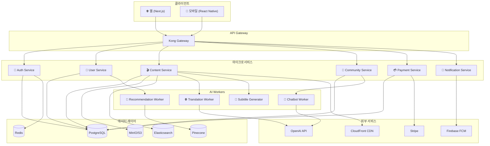

# CONTEXT.md - 프로젝트 Single Source of Truth

## 변경 이력 (Changelog)

| 버전 | 날짜 | 작성자 | 변경 내용 |
|------|------|--------|----------|
| 1.0.0 | 2025-11-25 | @hallyulatino-team | 최초 작성 |

## 관련 문서 (Related Documents)

- [README.md](./README.md) - 빠른 시작 가이드
- [PRD.md](./docs/specs/PRD.md) - 제품 요구사항 문서
- [ARCHITECTURE.md](./docs/specs/ARCHITECTURE.md) - 시스템 아키텍처

---

## 1. 프로젝트 개요 (Project Overview)

### 1.1 프로젝트명
**HallyuLatino** (한류라티노)

### 1.2 한 줄 설명
라틴 아메리카 시장을 위한 AI 기반 한류 콘텐츠 스트리밍 및 커뮤니티 플랫폼

### 1.3 비전 (Vision)
> "한류의 감동을 언어와 문화의 장벽 없이 라틴 아메리카 전역에 전달한다"

### 1.4 미션 (Mission)
- AI 기반 실시간 번역 및 자막 서비스 제공
- K-Drama, K-Pop, K-Beauty 콘텐츠 큐레이션
- 한류 팬 커뮤니티 구축 및 운영
- 크리에이터와 팬을 연결하는 인터랙티브 플랫폼

---

## 2. 핵심 가치 제안 (Value Proposition)

```
┌─────────────────────────────────────────────────────────────┐
│                    HallyuLatino 가치 제안                     │
├─────────────────────────────────────────────────────────────┤
│  🌐 언어 장벽 해소     │  AI 실시간 번역/더빙 (한↔스페인어/포르투갈어) │
│  🎬 큐레이션 콘텐츠    │  라틴 취향 맞춤형 K-콘텐츠 추천           │
│  👥 커뮤니티          │  팬 소통, 이벤트, 굿즈 마켓플레이스         │
│  🤖 AI 어시스턴트     │  한류 정보 챗봇, 학습 도우미               │
└─────────────────────────────────────────────────────────────┘
```

---

## 3. 타겟 사용자 (Target Users)

### 3.1 주요 페르소나

| 페르소나 | 설명 | 니즈 |
|----------|------|------|
| **Maria (25, 멕시코)** | K-Drama 열성 팬, 기본 영어 가능 | 스페인어 자막, 커뮤니티 참여 |
| **Lucas (19, 브라질)** | K-Pop 팬, 아이돌 덕질 | 포르투갈어 콘텐츠, 실시간 소식 |
| **Sofia (32, 아르헨티나)** | K-Beauty 관심, 구매력 있음 | 제품 리뷰, 구매 가이드 |
| **Diego (28, 콜롬비아)** | 한국어 학습자 | 학습 콘텐츠, 원어민 교류 |

### 3.2 타겟 시장

- **1차 타겟**: 멕시코, 브라질, 아르헨티나, 콜롬비아, 칠레
- **2차 타겟**: 페루, 베네수엘라, 에콰도르
- **시장 규모**: 라틴 아메리카 한류 팬 약 1억 명 (추정)

---

## 4. 기술 스택 (Tech Stack)

### 4.1 프론트엔드 (Frontend)

| 기술 | 버전 | 용도 |
|------|------|------|
| Next.js | 14.x | React 프레임워크, SSR/SSG |
| TypeScript | 5.x | 타입 안정성 |
| Tailwind CSS | 3.x | 유틸리티 CSS |
| Zustand | 4.x | 상태 관리 |
| React Query | 5.x | 서버 상태 관리 |
| Framer Motion | 10.x | 애니메이션 |

### 4.2 백엔드 (Backend)

| 기술 | 버전 | 용도 |
|------|------|------|
| Python | 3.12.x | 메인 언어 |
| FastAPI | 0.109.x | API 프레임워크 |
| SQLAlchemy | 2.x | ORM |
| Pydantic | 2.x | 데이터 검증 |
| Celery | 5.x | 비동기 작업 큐 |
| Redis | 7.x | 캐시, 세션, 큐 브로커 |

### 4.3 데이터베이스 (Database)

| 기술 | 버전 | 용도 |
|------|------|------|
| PostgreSQL | 16.x | 주 데이터베이스 |
| Redis | 7.x | 캐시, 세션 |
| Elasticsearch | 8.x | 검색 엔진 |
| MinIO | latest | 오브젝트 스토리지 (S3 호환) |

### 4.4 AI/ML 파이프라인

| 기술 | 용도 |
|------|------|
| OpenAI GPT-4 | 번역, 챗봇 |
| Whisper | 음성 인식 (자막 생성) |
| ElevenLabs | AI 더빙 |
| LangChain | LLM 오케스트레이션 |
| Pinecone | 벡터 DB (추천 시스템) |

### 4.5 인프라 (Infrastructure)

| 기술 | 용도 |
|------|------|
| AWS | 클라우드 인프라 |
| Kubernetes (EKS) | 컨테이너 오케스트레이션 |
| Terraform | IaC |
| GitHub Actions | CI/CD |
| Datadog | 모니터링 |
| Sentry | 에러 트래킹 |

---

## 5. 시스템 아키텍처 개요 (Architecture Overview)



---

## 6. 핵심 기능 (Core Features)

### 6.1 MVP (Minimum Viable Product)

| 기능 | 설명 | 우선순위 |
|------|------|----------|
| 사용자 인증 | 이메일/소셜 로그인 (Google, Facebook) | P0 |
| 콘텐츠 스트리밍 | K-Drama, K-Pop MV 스트리밍 | P0 |
| AI 자막 | 실시간 한→스페인어/포르투갈어 번역 자막 | P0 |
| 콘텐츠 검색 | 제목, 배우, 장르별 검색 | P0 |
| 사용자 프로필 | 시청 기록, 즐겨찾기 | P1 |
| 추천 시스템 | 시청 기록 기반 개인화 추천 | P1 |

### 6.2 Phase 2

| 기능 | 설명 | 우선순위 |
|------|------|----------|
| 커뮤니티 | 게시판, 댓글, 좋아요 | P1 |
| AI 챗봇 | 한류 정보 질의응답 | P2 |
| 실시간 채팅 | 시청 중 실시간 채팅 | P2 |
| 굿즈 마켓 | K-Pop 굿즈 마켓플레이스 | P2 |

### 6.3 Phase 3

| 기능 | 설명 | 우선순위 |
|------|------|----------|
| AI 더빙 | 스페인어/포르투갈어 AI 더빙 | P3 |
| 한국어 학습 | 드라마 기반 한국어 학습 | P3 |
| 크리에이터 플랫폼 | 팬 콘텐츠 업로드 및 수익화 | P3 |
| 라이브 이벤트 | 온라인 팬미팅, 콘서트 스트리밍 | P3 |

---

## 7. 비기능 요구사항 (Non-Functional Requirements)

### 7.1 성능 (Performance)

| 지표 | 목표 |
|------|------|
| API 응답 시간 (P95) | < 200ms |
| 페이지 로드 시간 (LCP) | < 2.5s |
| 동시 접속자 | 10,000명 |
| 스트리밍 시작 시간 | < 3s |

### 7.2 가용성 (Availability)

| 지표 | 목표 |
|------|------|
| 서비스 가용성 | 99.9% (월간) |
| RTO (복구 시간 목표) | < 1시간 |
| RPO (복구 지점 목표) | < 15분 |

### 7.3 보안 (Security)

- OWASP Top 10 취약점 대응
- 데이터 암호화 (전송 중: TLS 1.3, 저장 시: AES-256)
- GDPR, LGPD (브라질 개인정보보호법) 준수
- SOC 2 Type II 인증 목표

### 7.4 확장성 (Scalability)

- 수평 확장 가능한 마이크로서비스 아키텍처
- Auto Scaling 기반 동적 리소스 관리
- 지역별 CDN 배포 (라틴 아메리카 PoP)

---

## 8. 프로젝트 구조 (Project Structure)

```
📦 hallyulatino/
│
├── 📄 CONTEXT.md                 # 이 문서 - 프로젝트 SSOT
├── 📄 README.md                  # 프로젝트 소개 및 빠른 시작
├── 📄 plan.md                    # TDD 개발 계획
├── 📄 ENVIRONMENT.md             # 환경 설정 가이드
├── 📄 CONTRIBUTING.md            # 기여 가이드
├── 📄 .env.example               # 환경변수 템플릿
├── 📄 docker-compose.yml         # 로컬 개발 환경
│
├── 📁 .github/                   # GitHub 설정
│   ├── 📁 workflows/             # CI/CD
│   └── 📁 ISSUE_TEMPLATE/        # 이슈 템플릿
│
├── 📁 docs/                      # 문서
│   ├── 📁 specs/                 # 기술 스펙
│   ├── 📁 guides/                # 개발 가이드
│   ├── 📁 business/              # 비즈니스 문서
│   └── 📁 operations/            # 운영 문서
│
├── 📁 src/                       # 소스 코드
│   ├── 📁 frontend/              # Next.js 프론트엔드
│   ├── 📁 backend/               # FastAPI 백엔드
│   ├── 📁 worker/                # AI Worker
│   └── 📁 shared/                # 공유 코드
│
├── 📁 tests/                     # 테스트
│   ├── 📁 unit/                  # 단위 테스트
│   ├── 📁 integration/           # 통합 테스트
│   └── 📁 e2e/                   # E2E 테스트
│
├── 📁 scripts/                   # 유틸리티 스크립트
└── 📁 infra/                     # IaC (Terraform)
```

---

## 9. 개발 원칙 (Development Principles)

### 9.1 TDD (Test-Driven Development)
- 모든 기능은 테스트 케이스 작성 후 구현
- 테스트 커버리지 목표: Unit 80%, Integration 60%

### 9.2 Clean Architecture
- 의존성 역전 원칙 (DIP) 준수
- 계층 분리: Domain → Application → Infrastructure

### 9.3 API-First Design
- OpenAPI 3.0 스펙 우선 정의
- 백엔드/프론트엔드 병렬 개발 가능

### 9.4 Trunk-Based Development
- `main` 브랜치 중심 개발
- Feature Flag 기반 점진적 릴리스

---

## 10. 주요 용어 사전 (Glossary)

| 용어 | 영문 | 설명 |
|------|------|------|
| 한류 | Hallyu / Korean Wave | 한국 대중문화의 해외 인기 현상 |
| 컨텐츠 | Content | K-Drama, K-Pop, K-Beauty 등 미디어 |
| 큐레이션 | Curation | 사용자 맞춤형 콘텐츠 선별 |
| 더빙 | Dubbing | 음성 번역 및 대체 |
| 자막 | Subtitle | 화면 하단 번역 텍스트 |
| 스트리밍 | Streaming | 실시간 미디어 재생 |
| 추천 시스템 | Recommendation System | AI 기반 개인화 추천 |

---

## 11. 연락처 및 리소스 (Contacts & Resources)

### 11.1 팀 연락처
- **프로젝트 리드**: @hallyulatino-team
- **기술 문의**: tech@hallyulatino.com
- **비즈니스 문의**: biz@hallyulatino.com

### 11.2 외부 리소스
- **디자인 시스템**: Figma (링크 TBD)
- **API 문서**: Swagger UI (링크 TBD)
- **모니터링 대시보드**: Datadog (링크 TBD)

---

## 12. AI 에이전트를 위한 컨텍스트 요약 (AI Context Summary)

```
┌─────────────────────────────────────────────────────────────┐
│ 🤖 AI AGENT QUICK REFERENCE                                 │
├─────────────────────────────────────────────────────────────┤
│ Project: HallyuLatino                                       │
│ Type: Streaming + Community Platform                        │
│ Target: Latin American K-Content Fans                       │
│                                                             │
│ Tech Stack:                                                 │
│ - Frontend: Next.js 14, TypeScript, Tailwind               │
│ - Backend: Python 3.12, FastAPI, SQLAlchemy                │
│ - Database: PostgreSQL 16, Redis 7, Elasticsearch 8        │
│ - AI: OpenAI GPT-4, Whisper, LangChain, Pinecone          │
│ - Infra: AWS, Kubernetes, Terraform                        │
│                                                             │
│ Key Features:                                               │
│ - Video streaming with AI-generated subtitles              │
│ - Real-time translation (KO ↔ ES/PT)                       │
│ - Personalized content recommendation                       │
│ - Fan community and marketplace                            │
│                                                             │
│ Languages:                                                  │
│ - Documentation: Korean (한국어)                            │
│ - Code comments: Korean (한국어)                            │
│ - Code (vars/functions): English                           │
│ - Commit messages: English                                  │
└─────────────────────────────────────────────────────────────┘
```

---

*이 문서는 프로젝트의 Single Source of Truth입니다. 모든 의사결정과 구현은 이 문서를 기준으로 합니다.*
