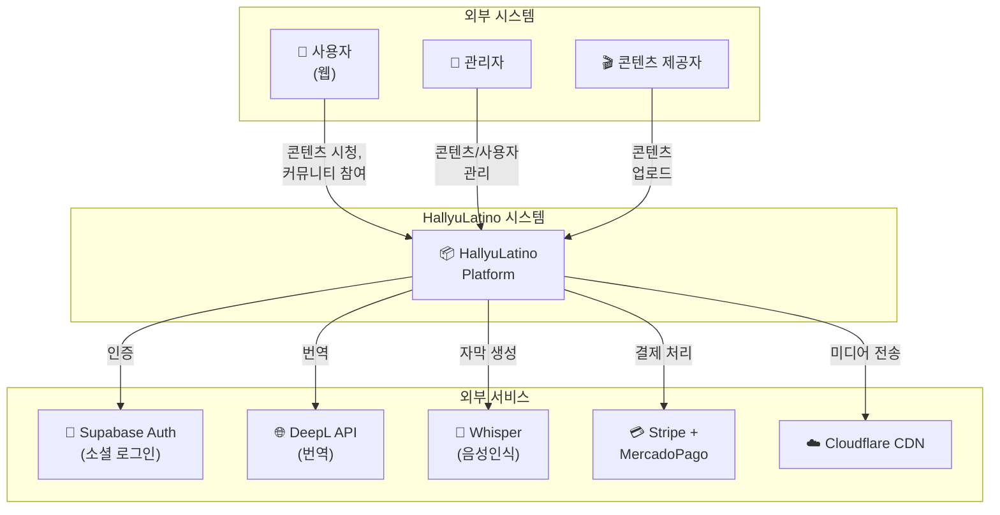
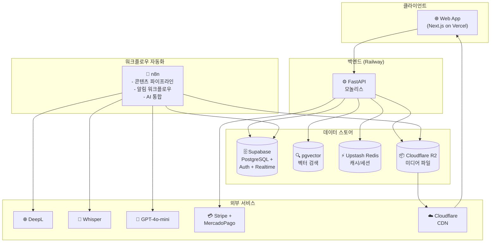
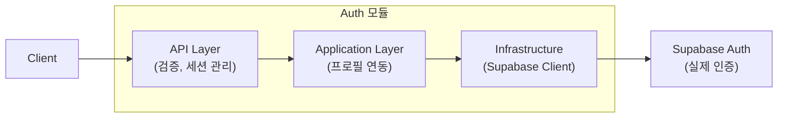
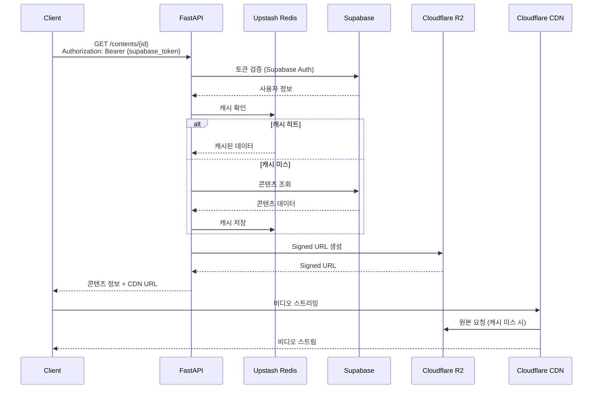
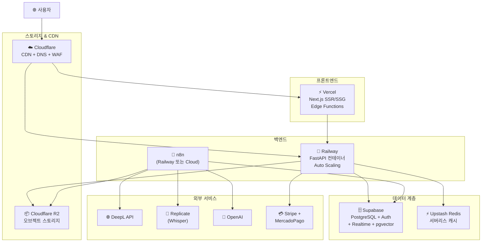
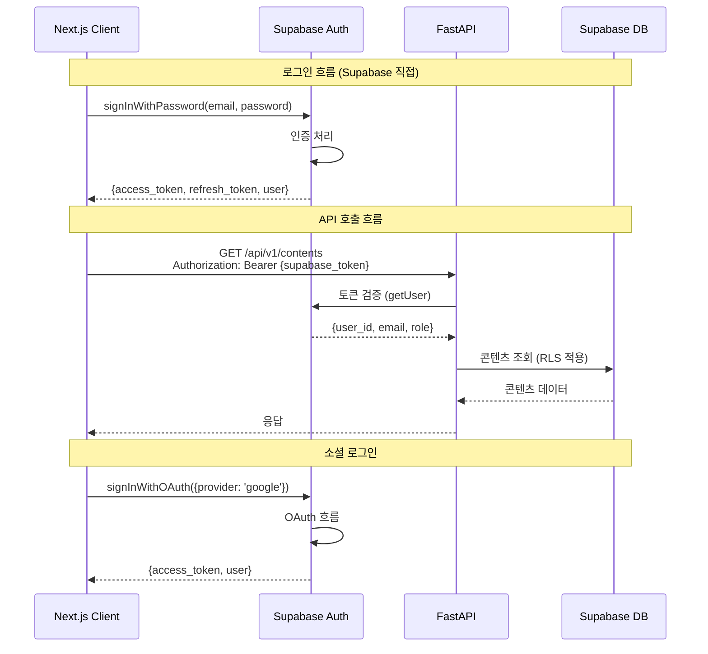
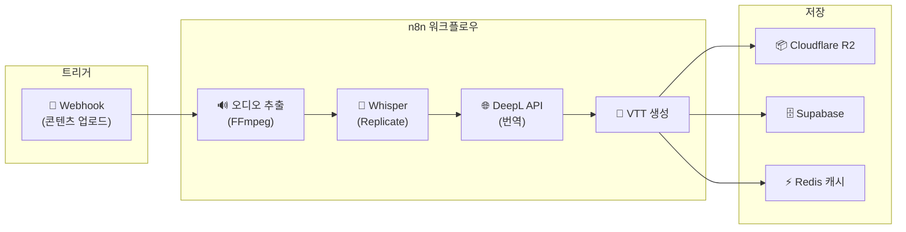
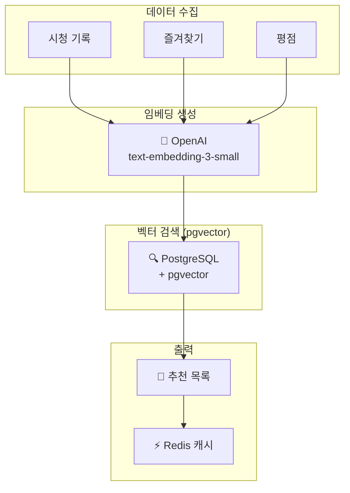
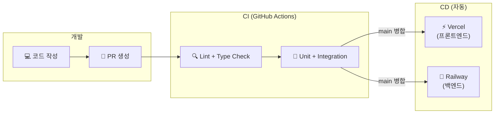

# ARCHITECTURE.md - 시스템 아키텍처

## 변경 이력 (Changelog)

| 버전 | 날짜 | 작성자 | 변경 내용 |
|------|------|--------|----------|
| 2.0.0 | 2025-11-25 | @hallyulatino-team | MVP 최적화: 모놀리스 아키텍처, n8n 도입 |
| 1.0.0 | 2025-11-25 | @hallyulatino-team | 최초 작성 |

## 관련 문서 (Related Documents)

- [CONTEXT.md](../../CONTEXT.md) - 프로젝트 컨텍스트
- [PRD.md](./PRD.md) - 제품 요구사항
- [API_SPEC.md](./API_SPEC.md) - API 명세
- [DATA_MODEL.md](./DATA_MODEL.md) - 데이터 모델

---

## 1. 아키텍처 개요 (Architecture Overview)

> ⚡ **MVP 최적화**: 모놀리스 우선, 필요시 마이크로서비스로 전환

### 1.1 아키텍처 원칙

| 원칙 | 설명 |
|------|------|
| **모듈형 모놀리스** | 단일 배포 단위로 시작, 모듈 경계 유지 |
| **워크플로우 자동화** | n8n으로 비동기 작업 오케스트레이션 |
| **서버리스 우선** | Vercel, Supabase, Upstash 등 관리형 서비스 |
| **API First** | OpenAPI 스펙 우선 정의 |
| **비용 효율** | MVP 단계 $200/월 이하 유지 |

### 1.2 C4 모델: 시스템 컨텍스트



### 1.3 C4 모델: 컨테이너 다이어그램



---

## 2. 서비스 아키텍처 (Service Architecture)

> ⚡ **모놀리스 구조**: 도메인별 모듈로 구성, 단일 배포 단위

### 2.1 모듈 구조

| 모듈 | 책임 | 외부 의존성 |
|--------|------|--------|
| `auth` | 인증/인가 (Supabase 위임) | Supabase Auth |
| `users` | 사용자 프로필 관리 | Supabase |
| `content` | 콘텐츠 CRUD, 스트리밍 | Supabase, R2 |
| `community` | 게시판, 댓글 | Supabase |
| `payment` | 결제 처리 | Stripe, MercadoPago |
| `search` | 검색 (PostgreSQL FTS) | Supabase |
| `recommendation` | 추천 (pgvector) | pgvector |

### 2.2 모놀리스 프로젝트 구조

```
src/backend/
├── main.py                 # FastAPI 앱 진입점
├── config.py               # 환경 설정
├── dependencies.py         # 공통 DI
│
├── modules/                # 도메인 모듈 (Clean Architecture)
│   ├── auth/
│   │   ├── api/            # 라우터, 스키마
│   │   ├── application/    # 유스케이스
│   │   ├── domain/         # 엔티티, 값 객체
│   │   └── infrastructure/ # 외부 서비스 연동
│   │
│   ├── users/
│   ├── content/
│   ├── community/
│   ├── payment/
│   ├── search/
│   └── recommendation/
│
├── shared/                 # 공통 코드
│   ├── database.py         # Supabase 클라이언트
│   ├── cache.py            # Upstash Redis
│   ├── storage.py          # Cloudflare R2
│   └── exceptions.py       # 공통 예외
│
└── tests/
    ├── unit/
    ├── integration/
    └── conftest.py
```

### 2.3 모듈 상세: Auth (Supabase 위임)



> ⚡ **최적화**: 인증 로직은 Supabase Auth에 위임. 백엔드는 토큰 검증과 프로필 동기화만 담당

```python
# src/backend/modules/auth/infrastructure/supabase_auth.py
from supabase import create_client

class SupabaseAuthService:
    """Supabase Auth 래퍼"""

    async def verify_token(self, token: str) -> dict:
        """JWT 토큰 검증 (Supabase 위임)"""
        user = self.client.auth.get_user(token)
        return user

    async def get_or_create_profile(self, supabase_user_id: str) -> UserProfile:
        """사용자 프로필 조회 또는 생성"""
        # ...
```

### 2.4 모듈 상세: Content

```
src/backend/modules/content/
├── api/
│   └── v1/
│       ├── routes.py       # GET /contents, GET /contents/{id}
│       └── schemas.py      # ContentResponse, EpisodeResponse
│
├── application/
│   ├── get_content.py      # 콘텐츠 조회
│   ├── list_contents.py    # 목록 조회 (필터, 페이징)
│   └── get_streaming_url.py # R2 Signed URL 생성
│
├── domain/
│   ├── content.py          # Content 엔티티
│   ├── episode.py          # Episode 엔티티
│   └── watch_progress.py   # 시청 진행률
│
└── infrastructure/
    ├── content_repository.py  # Supabase 쿼리
    └── r2_storage.py          # Cloudflare R2 연동
```

---

## 3. 데이터 아키텍처 (Data Architecture)

### 3.1 데이터 저장소 선택 기준

| 데이터 유형 | 저장소 | 이유 | 비용 |
|-------------|--------|------|------|
| 트랜잭션 데이터 | Supabase (PostgreSQL) | ACID, Auth 통합, Realtime | 무료~$25/월 |
| 세션/캐시 | Upstash Redis | 서버리스, Pay-per-use | 무료~$10/월 |
| 검색 인덱스 | PostgreSQL FTS | 추가 서비스 불필요 | 포함 |
| 벡터 임베딩 | pgvector | PostgreSQL 확장, 무료 | 포함 |
| 미디어 파일 | Cloudflare R2 | 이그레스 무료, 라틴 PoP | 무료~$15/월 |

> ⚡ **최적화**: Elasticsearch, Pinecone 제거로 월 $200+ 절감

### 3.2 데이터 흐름



### 3.3 캐싱 전략 (Upstash Redis)

| 데이터 | 캐시 TTL | 캐시 키 패턴 |
|--------|----------|--------------|
| 콘텐츠 메타데이터 | 1시간 | `content:{content_id}` |
| 콘텐츠 목록 | 5분 | `contents:list:{page}:{filters_hash}` |
| 검색 결과 | 10분 | `search:{query_hash}` |
| 추천 결과 | 1시간 | `recommend:{user_id}` |
| **번역된 자막** | 7일 | `subtitle:{content_id}:{lang}` |
| Rate Limit | 1분 | `rate:{user_id}:{endpoint}` |

> ⚡ **중요**: 번역 자막은 장기 캐싱으로 DeepL API 비용 최소화

### 3.4 벡터 검색 (pgvector)

```sql
-- pgvector 확장 활성화
CREATE EXTENSION IF NOT EXISTS vector;

-- 콘텐츠 임베딩 테이블
CREATE TABLE content_embeddings (
    content_id UUID PRIMARY KEY REFERENCES contents(id),
    embedding vector(1536),  -- OpenAI embedding 차원
    created_at TIMESTAMPTZ DEFAULT NOW()
);

-- 유사 콘텐츠 검색 (코사인 유사도)
SELECT content_id, 1 - (embedding <=> $1) AS similarity
FROM content_embeddings
ORDER BY embedding <=> $1
LIMIT 10;
```

> ⚡ **최적화**: Pinecone 대신 pgvector 사용으로 월 $70+ 절감

---

## 4. 인프라 아키텍처 (Infrastructure Architecture)

> ⚡ **MVP 최적화**: 관리형 서비스 중심, Kubernetes 없이 시작

### 4.1 서버리스 인프라 구성



### 4.2 환경별 구성

| 환경 | 프론트엔드 | 백엔드 | 데이터베이스 | 비용/월 |
|------|-----------|--------|------------|---------|
| **Development** | Vercel Preview | Railway Dev | Supabase 무료 | ~$5 |
| **Staging** | Vercel Preview | Railway Starter | Supabase Pro | ~$50 |
| **Production** | Vercel Pro | Railway Pro | Supabase Pro | ~$150 |

### 4.3 Railway 배포 구성

```toml
# railway.toml
[build]
builder = "DOCKERFILE"
dockerfilePath = "Dockerfile"

[deploy]
numReplicas = 2
startCommand = "uvicorn main:app --host 0.0.0.0 --port $PORT"
healthcheckPath = "/health"
healthcheckTimeout = 100
restartPolicyType = "ON_FAILURE"

[deploy.resources]
memory = "512Mi"
cpu = "0.5"
```

```dockerfile
# Dockerfile
FROM python:3.12-slim

WORKDIR /app

COPY requirements.txt .
RUN pip install --no-cache-dir -r requirements.txt

COPY src/backend ./

EXPOSE 8000
CMD ["uvicorn", "main:app", "--host", "0.0.0.0", "--port", "8000"]
```

### 4.4 확장 전략

```
┌─────────────────────────────────────────────────────────────┐
│                    확장 로드맵                               │
├─────────────────────────────────────────────────────────────┤
│                                                             │
│  Phase 1 (MVP): 현재 구성                                    │
│  ├─ Railway 단일 인스턴스                                    │
│  ├─ Supabase 무료/Pro                                       │
│  └─ 예상 트래픽: 1,000 DAU                                  │
│                                                             │
│  Phase 2 (Growth): Railway 스케일업                          │
│  ├─ Railway Pro (Auto Scaling)                              │
│  ├─ Supabase Pro (Connection Pooling)                       │
│  └─ 예상 트래픽: 10,000 DAU                                 │
│                                                             │
│  Phase 3 (Scale): 필요시 마이그레이션                        │
│  ├─ AWS/GCP로 마이그레이션 검토                              │
│  ├─ Kubernetes 도입 검토                                    │
│  └─ 예상 트래픽: 100,000+ DAU                               │
│                                                             │
└─────────────────────────────────────────────────────────────┘
```

> ⚡ **원칙**: "지금 필요한 것만 구축, 필요할 때 확장"

---

## 5. 보안 아키텍처 (Security Architecture)

> ⚡ **MVP 최적화**: 관리형 서비스의 내장 보안 기능 최대 활용

### 5.1 보안 계층

```
┌─────────────────────────────────────────────────────────────┐
│                    보안 계층 (Defense in Depth)              │
├─────────────────────────────────────────────────────────────┤
│                                                             │
│  Layer 1: 엣지 보안 (Cloudflare)                             │
│  ├─ WAF (Cloudflare WAF 무료 티어)                          │
│  ├─ DDoS 방어 (Cloudflare 무료)                             │
│  └─ Bot 관리                                                │
│                                                             │
│  Layer 2: 인증 (Supabase Auth)                              │
│  ├─ JWT 토큰 (자동 관리)                                    │
│  ├─ 소셜 로그인 (Google, Facebook)                          │
│  └─ Row Level Security (RLS)                               │
│                                                             │
│  Layer 3: 애플리케이션 보안                                   │
│  ├─ 입력 검증 (Pydantic)                                    │
│  ├─ SQL Injection 방지 (Supabase Client)                   │
│  └─ CORS 설정 (FastAPI)                                    │
│                                                             │
│  Layer 4: 데이터 보안 (Supabase)                             │
│  ├─ 암호화 at Rest (자동)                                   │
│  ├─ 암호화 in Transit (TLS)                                 │
│  └─ 비밀번호 해싱 (Supabase Auth)                           │
│                                                             │
│  Layer 5: 비밀 관리                                          │
│  ├─ Railway 환경변수                                        │
│  ├─ Vercel 환경변수                                         │
│  └─ .env 로컬 개발                                          │
│                                                             │
└─────────────────────────────────────────────────────────────┘
```

### 5.2 인증/인가 흐름 (Supabase Auth)



### 5.3 Row Level Security (RLS)

```sql
-- 사용자는 자신의 프로필만 수정 가능
CREATE POLICY "Users can update own profile"
ON profiles FOR UPDATE
USING (auth.uid() = user_id);

-- 프리미엄 사용자만 HD 콘텐츠 접근
CREATE POLICY "Premium users access HD content"
ON contents FOR SELECT
USING (
  quality = 'SD' OR
  EXISTS (
    SELECT 1 FROM subscriptions
    WHERE user_id = auth.uid() AND status = 'active'
  )
);
```

### 5.4 RBAC (Role-Based Access Control)

| 역할 | 권한 | 구현 |
|------|------|------|
| `user` | 콘텐츠 시청, 프로필 관리 | Supabase 기본 |
| `premium` | user + HD 화질, 다운로드 | subscription 테이블 |
| `creator` | premium + 콘텐츠 업로드 | role 컬럼 |
| `admin` | 전체 관리 권한 | Supabase Dashboard |

---

## 6. AI 파이프라인 아키텍처 (AI Pipeline Architecture)

> ⚡ **n8n 기반**: 워크플로우 자동화로 Celery 대체, 비용 절감

### 6.1 콘텐츠 처리 파이프라인 (n8n)



### 6.2 n8n 워크플로우 예시

```json
{
  "name": "콘텐츠 자막 생성 파이프라인",
  "nodes": [
    {
      "name": "Webhook",
      "type": "n8n-nodes-base.webhook",
      "parameters": {
        "path": "content-upload",
        "httpMethod": "POST"
      }
    },
    {
      "name": "Whisper (Replicate)",
      "type": "n8n-nodes-base.httpRequest",
      "parameters": {
        "url": "https://api.replicate.com/v1/predictions",
        "method": "POST",
        "body": {
          "version": "whisper-large-v3",
          "input": { "audio": "={{ $json.audio_url }}" }
        }
      }
    },
    {
      "name": "DeepL 번역",
      "type": "n8n-nodes-base.deepL",
      "parameters": {
        "text": "={{ $json.transcription }}",
        "targetLanguage": "ES"
      }
    },
    {
      "name": "Supabase 저장",
      "type": "n8n-nodes-base.supabase",
      "parameters": {
        "operation": "insert",
        "table": "subtitles"
      }
    }
  ]
}
```

### 6.3 추천 파이프라인 (pgvector)



### 6.4 비용 비교

| 항목 | 이전 (GPT-4 + Pinecone) | 최적화 (DeepL + pgvector) |
|------|-------------------------|--------------------------|
| 번역 (1M 문자/월) | ~$60 (GPT-4) | ~$5 (DeepL Free) |
| 벡터 DB | ~$70 (Pinecone) | $0 (pgvector) |
| 워커 | ~$50 (Celery + RabbitMQ) | ~$10 (n8n) |
| **총합** | ~$180/월 | ~$15/월 |

> ⚡ **90% 비용 절감** (품질은 DeepL이 번역 전문으로 더 우수)

---

## 7. 모니터링 및 관찰성 (Monitoring & Observability)

> ⚡ **MVP 최적화**: 무료/저가 관리형 서비스 활용

### 7.1 관찰성 스택

```
┌─────────────────────────────────────────────────────────────┐
│                    관찰성 스택 (MVP)                         │
├─────────────────────────────────────────────────────────────┤
│                                                             │
│  🐛 에러 트래킹 (Sentry - 무료 티어)                         │
│  ├─ 프론트엔드 에러 캡처 (Next.js)                           │
│  ├─ 백엔드 예외 추적 (FastAPI)                               │
│  └─ 릴리스 버전 트래킹                                       │
│                                                             │
│  📊 업타임 & 로그 (BetterStack - 무료 티어)                  │
│  ├─ HTTP 엔드포인트 모니터링                                  │
│  ├─ 구조화된 로그 수집                                       │
│  └─ 상태 페이지 (status.hallyulatino.com)                   │
│                                                             │
│  📈 분석 (플랫폼 내장)                                       │
│  ├─ Vercel Analytics (프론트엔드)                            │
│  ├─ Railway Metrics (백엔드)                                 │
│  └─ Supabase Dashboard (DB)                                 │
│                                                             │
│  🚨 알림 (Slack/Discord)                                     │
│  ├─ Sentry → Slack                                          │
│  ├─ BetterStack → Slack                                     │
│  └─ n8n 워크플로우 알림                                      │
│                                                             │
└─────────────────────────────────────────────────────────────┘
```

### 7.2 핵심 메트릭

| 카테고리 | 메트릭 | 알림 임계값 | 도구 |
|----------|--------|-------------|------|
| 가용성 | 서비스 업타임 | < 99% | BetterStack |
| 에러 | 5xx 에러율 | > 5% | Sentry |
| 성능 | API P95 응답 시간 | > 500ms | Railway |
| 성능 | Web Vitals (LCP) | > 2.5s | Vercel |
| DB | 쿼리 성능 | > 1s | Supabase |

### 7.3 로깅 설정

```python
# src/backend/shared/logging.py
import structlog
from betterstack import BetterstackHandler

def setup_logging():
    structlog.configure(
        processors=[
            structlog.processors.TimeStamper(fmt="iso"),
            structlog.processors.JSONRenderer()
        ],
        logger_factory=structlog.PrintLoggerFactory(),
    )

# 사용 예시
logger = structlog.get_logger()
logger.info("content_viewed", content_id=content_id, user_id=user_id)
```

---

## 8. 배포 전략 (Deployment Strategy)

> ⚡ **자동 배포**: Git Push 기반 자동 배포

### 8.1 CI/CD 파이프라인



### 8.2 배포 방식

| 서비스 | 플랫폼 | 배포 트리거 | 롤백 |
|--------|--------|------------|------|
| Frontend | Vercel | Git Push (main) | Vercel 대시보드 |
| Backend | Railway | Git Push (main) | Railway 대시보드 |
| n8n | Railway | 수동 | Railway 대시보드 |

### 8.3 GitHub Actions 설정

```yaml
# .github/workflows/ci.yml
name: CI

on:
  push:
    branches: [main, develop]
  pull_request:
    branches: [main]

jobs:
  test:
    runs-on: ubuntu-latest
    steps:
      - uses: actions/checkout@v4

      - name: Setup Python
        uses: actions/setup-python@v5
        with:
          python-version: '3.12'

      - name: Install dependencies
        run: |
          pip install -r requirements.txt
          pip install -r requirements-dev.txt

      - name: Lint
        run: |
          ruff check .
          mypy src/

      - name: Test
        run: pytest tests/ --cov=src/

      # Vercel과 Railway는 자동 배포
```

---

## 9. 재해 복구 (Disaster Recovery)

> ⚡ **관리형 서비스**: 백업은 플랫폼에서 자동 처리

### 9.1 백업 전략

| 데이터 | 서비스 | 백업 | 보관 기간 |
|--------|--------|------|-----------|
| PostgreSQL | Supabase Pro | 일간 자동 | 7일 |
| 미디어 파일 | Cloudflare R2 | 멀티 리전 복제 | - |
| n8n 워크플로우 | Git 저장 | 커밋마다 | 영구 |

### 9.2 복구 목표

| 지표 | 목표 | 비고 |
|------|------|------|
| RTO (Recovery Time Objective) | < 4시간 | Supabase PITR |
| RPO (Recovery Point Objective) | < 24시간 | 일간 백업 기준 |

> ⚠️ **MVP 단계**: Supabase Pro의 Point-in-Time Recovery 활용. 더 빈번한 백업이 필요하면 Pro 플랜 이상 검토.

---

## 10. 아키텍처 결정 기록 (ADRs)

### ADR-0001: 초기 마이크로서비스 아키텍처 제안

- **상태**: Superseded by ADR-0002
- **컨텍스트**: 독립적인 확장성과 배포가 필요
- **결정**: 도메인별 마이크로서비스로 분리
- **결과**: 과도한 복잡성, 높은 운영 비용

### ADR-0002: MVP 최적화 - 모놀리스 전환

- **상태**: Accepted
- **컨텍스트**: MVP 단계에서 비용 효율성과 개발 속도 필요
- **결정**: 마이크로서비스 → 모듈형 모놀리스, n8n 도입, 관리형 서비스 활용
- **결과**: 월 비용 90% 절감 ($750→$45~195), 운영 복잡성 감소

[전체 ADR 목록](./ADRs/)

---

*이 문서는 시스템 아키텍처의 핵심 참조 문서입니다. 중요한 아키텍처 변경 시 업데이트합니다.*
