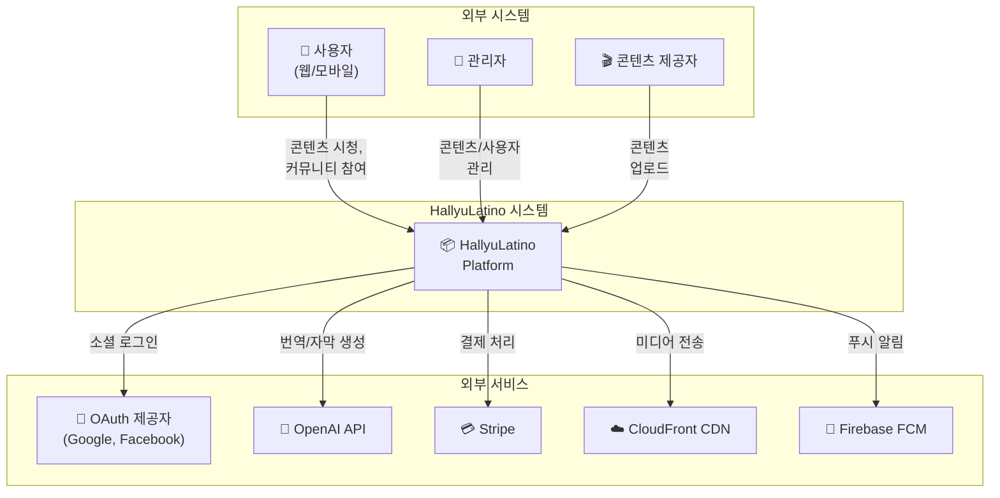
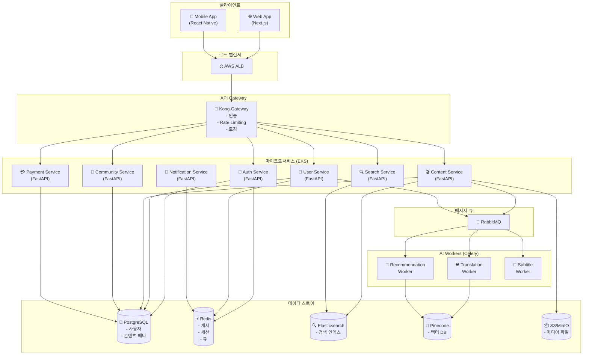
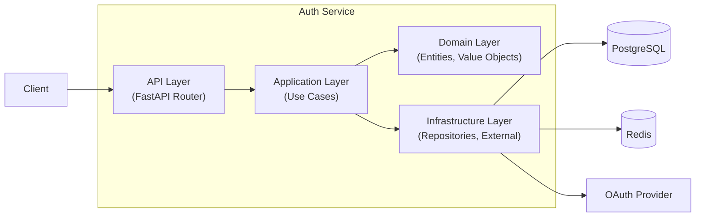
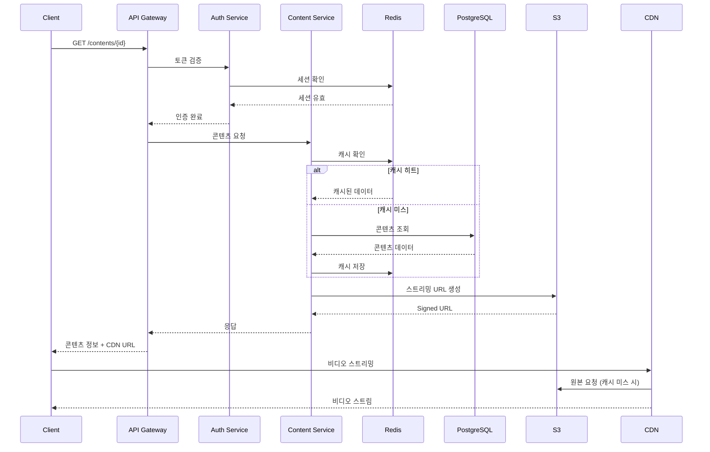
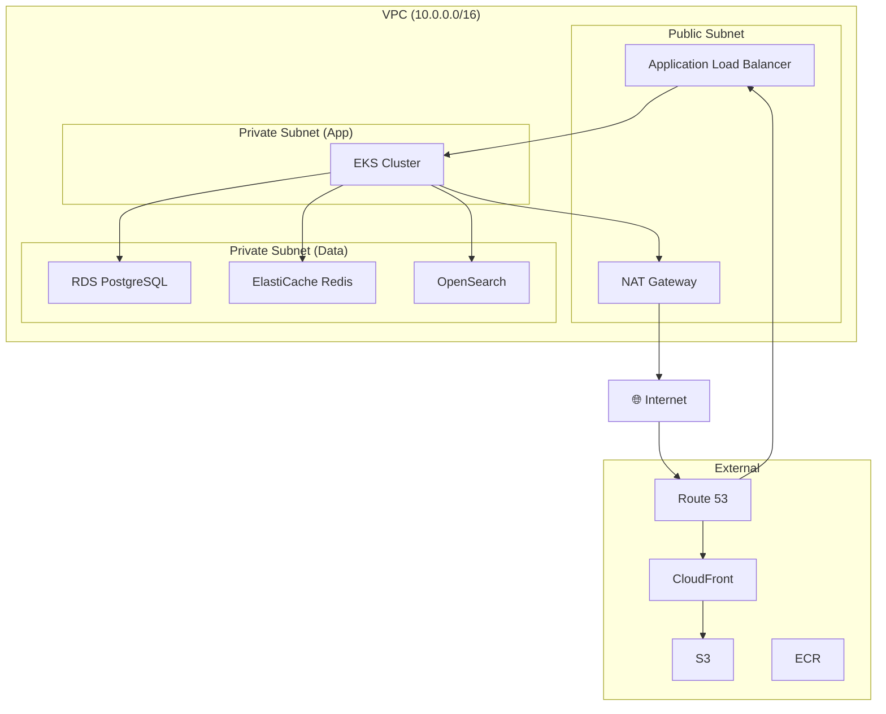
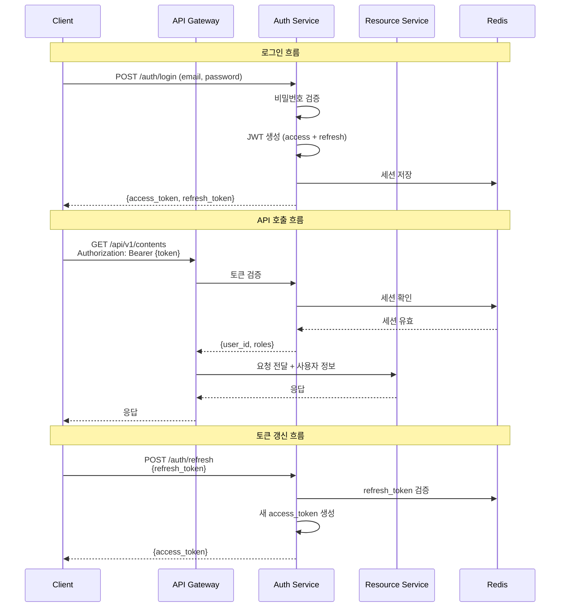
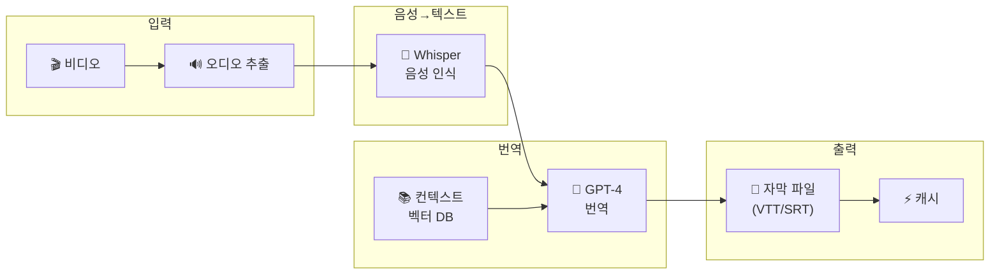
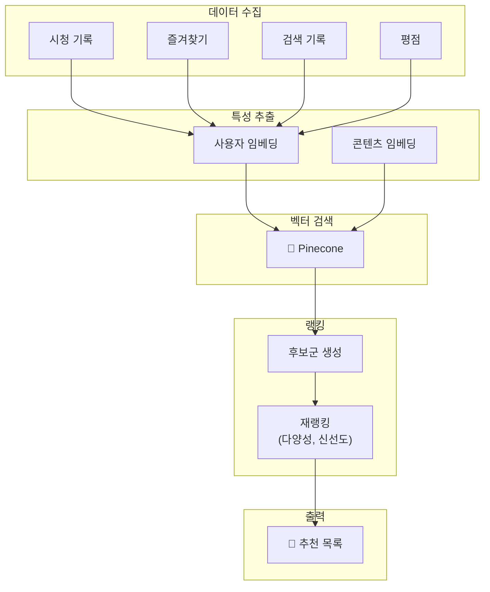
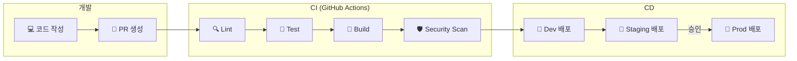

# ARCHITECTURE.md - 시스템 아키텍처

## 변경 이력 (Changelog)

| 버전 | 날짜 | 작성자 | 변경 내용 |
|------|------|--------|----------|
| 1.0.0 | 2025-11-25 | @hallyulatino-team | 최초 작성 |

## 관련 문서 (Related Documents)

- [CONTEXT.md](../../CONTEXT.md) - 프로젝트 컨텍스트
- [PRD.md](./PRD.md) - 제품 요구사항
- [API_SPEC.md](./API_SPEC.md) - API 명세
- [DATA_MODEL.md](./DATA_MODEL.md) - 데이터 모델

---

## 1. 아키텍처 개요 (Architecture Overview)

### 1.1 아키텍처 원칙

| 원칙 | 설명 |
|------|------|
| **마이크로서비스** | 도메인별 독립 서비스로 분리 |
| **이벤트 기반** | 비동기 메시징으로 서비스 간 결합도 최소화 |
| **클라우드 네이티브** | 컨테이너 기반 배포, Auto Scaling |
| **API First** | OpenAPI 스펙 우선 정의 |
| **보안 우선** | Zero Trust, Defense in Depth |

### 1.2 C4 모델: 시스템 컨텍스트



### 1.3 C4 모델: 컨테이너 다이어그램



---

## 2. 서비스 아키텍처 (Service Architecture)

### 2.1 서비스 목록

| 서비스 | 책임 | 포트 | 의존성 |
|--------|------|------|--------|
| API Gateway (Kong) | 라우팅, 인증, Rate Limiting | 8000 | Redis |
| Auth Service | 인증/인가 | 8001 | PostgreSQL, Redis |
| User Service | 사용자 관리 | 8002 | PostgreSQL, Redis |
| Content Service | 콘텐츠 관리 | 8003 | PostgreSQL, S3, ES |
| Community Service | 커뮤니티 기능 | 8004 | PostgreSQL |
| Payment Service | 결제 처리 | 8005 | PostgreSQL, Stripe |
| Notification Service | 알림 발송 | 8006 | Redis, FCM |
| Search Service | 검색 기능 | 8007 | Elasticsearch |

### 2.2 서비스 상세: Auth Service



**Clean Architecture 계층:**

```
src/backend/services/auth/
├── api/                    # API Layer
│   ├── v1/
│   │   ├── routes/
│   │   │   ├── auth.py     # 인증 라우트
│   │   │   └── oauth.py    # OAuth 라우트
│   │   └── schemas/
│   │       ├── request.py  # 요청 스키마
│   │       └── response.py # 응답 스키마
│   └── dependencies.py     # DI
│
├── application/            # Application Layer
│   ├── use_cases/
│   │   ├── login.py
│   │   ├── register.py
│   │   ├── refresh_token.py
│   │   └── oauth_login.py
│   └── interfaces/
│       └── repositories.py # Repository 인터페이스
│
├── domain/                 # Domain Layer
│   ├── entities/
│   │   └── user.py
│   ├── value_objects/
│   │   ├── email.py
│   │   └── password.py
│   └── exceptions.py
│
└── infrastructure/         # Infrastructure Layer
    ├── repositories/
    │   └── user_repository.py
    ├── external/
    │   ├── google_oauth.py
    │   └── facebook_oauth.py
    └── security/
        ├── jwt_service.py
        └── password_hasher.py
```

### 2.3 서비스 상세: Content Service

```
src/backend/services/content/
├── api/
│   └── v1/
│       ├── routes/
│       │   ├── contents.py
│       │   ├── episodes.py
│       │   └── streaming.py
│       └── schemas/
│
├── application/
│   ├── use_cases/
│   │   ├── get_content.py
│   │   ├── list_contents.py
│   │   ├── get_streaming_url.py
│   │   └── track_progress.py
│   └── interfaces/
│
├── domain/
│   ├── entities/
│   │   ├── content.py
│   │   ├── episode.py
│   │   └── watch_progress.py
│   └── value_objects/
│
└── infrastructure/
    ├── repositories/
    ├── storage/
    │   └── s3_service.py
    └── cdn/
        └── cloudfront_service.py
```

---

## 3. 데이터 아키텍처 (Data Architecture)

### 3.1 데이터 저장소 선택 기준

| 데이터 유형 | 저장소 | 이유 |
|-------------|--------|------|
| 트랜잭션 데이터 | PostgreSQL | ACID, 관계형 데이터 |
| 세션/캐시 | Redis | 고속 읽기/쓰기, TTL |
| 검색 인덱스 | Elasticsearch | 전문 검색, 분석 |
| 벡터 임베딩 | Pinecone | 유사도 검색, 추천 |
| 미디어 파일 | S3/MinIO | 대용량 객체 저장 |

### 3.2 데이터 흐름



### 3.3 캐싱 전략

| 데이터 | 캐시 TTL | 캐시 키 패턴 |
|--------|----------|--------------|
| 사용자 세션 | 30분 | `session:{user_id}` |
| 콘텐츠 메타데이터 | 1시간 | `content:{content_id}` |
| 콘텐츠 목록 | 5분 | `contents:list:{page}:{filters}` |
| 검색 결과 | 10분 | `search:{query_hash}` |
| 추천 결과 | 1시간 | `recommend:{user_id}` |

---

## 4. 인프라 아키텍처 (Infrastructure Architecture)

### 4.1 AWS 인프라 구성



### 4.2 Kubernetes 클러스터 구성

```yaml
# 네임스페이스 구조
namespaces:
  - hallyulatino-prod      # 프로덕션 워크로드
  - hallyulatino-staging   # 스테이징 워크로드
  - monitoring             # Prometheus, Grafana
  - logging                # EFK Stack
  - istio-system           # 서비스 메시

# 노드 그룹
node_groups:
  - name: api-nodes
    instance_type: m6i.large
    min_size: 2
    max_size: 10
    labels:
      workload: api

  - name: worker-nodes
    instance_type: c6i.xlarge
    min_size: 1
    max_size: 5
    labels:
      workload: worker

  - name: gpu-nodes
    instance_type: g4dn.xlarge
    min_size: 0
    max_size: 2
    labels:
      workload: ai
      nvidia.com/gpu: "true"
```

### 4.3 서비스 배포 구성

```yaml
# Deployment 예시: Auth Service
apiVersion: apps/v1
kind: Deployment
metadata:
  name: auth-service
  namespace: hallyulatino-prod
spec:
  replicas: 3
  selector:
    matchLabels:
      app: auth-service
  template:
    metadata:
      labels:
        app: auth-service
    spec:
      containers:
        - name: auth-service
          image: ecr.aws/hallyulatino/auth-service:v1.0.0
          ports:
            - containerPort: 8001
          resources:
            requests:
              memory: "256Mi"
              cpu: "250m"
            limits:
              memory: "512Mi"
              cpu: "500m"
          livenessProbe:
            httpGet:
              path: /health
              port: 8001
            initialDelaySeconds: 10
            periodSeconds: 30
          readinessProbe:
            httpGet:
              path: /ready
              port: 8001
            initialDelaySeconds: 5
            periodSeconds: 10
          env:
            - name: DATABASE_URL
              valueFrom:
                secretKeyRef:
                  name: auth-secrets
                  key: database-url
---
# HPA (Horizontal Pod Autoscaler)
apiVersion: autoscaling/v2
kind: HorizontalPodAutoscaler
metadata:
  name: auth-service-hpa
spec:
  scaleTargetRef:
    apiVersion: apps/v1
    kind: Deployment
    name: auth-service
  minReplicas: 3
  maxReplicas: 10
  metrics:
    - type: Resource
      resource:
        name: cpu
        target:
          type: Utilization
          averageUtilization: 70
```

---

## 5. 보안 아키텍처 (Security Architecture)

### 5.1 보안 계층

```
┌─────────────────────────────────────────────────────────────┐
│                    보안 계층 (Defense in Depth)              │
├─────────────────────────────────────────────────────────────┤
│                                                             │
│  Layer 1: 네트워크 보안                                       │
│  ├─ WAF (AWS WAF)                                           │
│  ├─ DDoS 방어 (AWS Shield)                                  │
│  └─ VPC, Security Groups, NACLs                             │
│                                                             │
│  Layer 2: 엣지 보안                                          │
│  ├─ TLS 1.3 종단간 암호화                                    │
│  ├─ CDN 보안 헤더                                           │
│  └─ Bot 감지                                                │
│                                                             │
│  Layer 3: API Gateway 보안                                   │
│  ├─ JWT 토큰 검증                                           │
│  ├─ Rate Limiting                                           │
│  └─ IP Whitelist/Blacklist                                  │
│                                                             │
│  Layer 4: 애플리케이션 보안                                   │
│  ├─ 입력 검증 (Pydantic)                                    │
│  ├─ SQL Injection 방지 (ORM)                                │
│  ├─ XSS 방지 (CSP)                                          │
│  └─ CSRF 보호                                               │
│                                                             │
│  Layer 5: 데이터 보안                                        │
│  ├─ 암호화 at Rest (AES-256)                                │
│  ├─ 암호화 in Transit (TLS)                                 │
│  └─ 비밀번호 해싱 (bcrypt)                                   │
│                                                             │
│  Layer 6: 인프라 보안                                        │
│  ├─ IAM 최소 권한                                           │
│  ├─ Secrets Manager                                         │
│  └─ 감사 로깅 (CloudTrail)                                  │
│                                                             │
└─────────────────────────────────────────────────────────────┘
```

### 5.2 인증/인가 흐름



### 5.3 RBAC (Role-Based Access Control)

| 역할 | 권한 |
|------|------|
| `user` | 콘텐츠 시청, 프로필 관리, 커뮤니티 참여 |
| `premium` | user + 광고 없음, HD 화질, 다운로드 |
| `creator` | premium + 콘텐츠 업로드 |
| `moderator` | creator + 콘텐츠/댓글 관리 |
| `admin` | 전체 관리 권한 |

---

## 6. AI 파이프라인 아키텍처 (AI Pipeline Architecture)

### 6.1 번역 파이프라인



### 6.2 추천 파이프라인



---

## 7. 모니터링 및 관찰성 (Monitoring & Observability)

### 7.1 관찰성 스택

```
┌─────────────────────────────────────────────────────────────┐
│                    관찰성 스택 (Observability)               │
├─────────────────────────────────────────────────────────────┤
│                                                             │
│  📊 Metrics (메트릭)                                         │
│  ├─ Prometheus: 메트릭 수집 및 저장                          │
│  ├─ Grafana: 대시보드 및 시각화                              │
│  └─ CloudWatch: AWS 인프라 메트릭                           │
│                                                             │
│  📝 Logs (로그)                                              │
│  ├─ Fluent Bit: 로그 수집기                                  │
│  ├─ Elasticsearch: 로그 저장소                               │
│  └─ Kibana: 로그 검색 및 분석                                │
│                                                             │
│  🔗 Traces (트레이스)                                        │
│  ├─ OpenTelemetry: 분산 트레이싱                             │
│  ├─ Jaeger: 트레이스 저장 및 시각화                          │
│  └─ X-Ray: AWS 서비스 트레이싱                               │
│                                                             │
│  🚨 Alerting (알림)                                          │
│  ├─ AlertManager: 알림 라우팅                                │
│  ├─ PagerDuty: On-call 관리                                 │
│  └─ Slack: 팀 알림                                          │
│                                                             │
└─────────────────────────────────────────────────────────────┘
```

### 7.2 핵심 메트릭

| 카테고리 | 메트릭 | 알림 임계값 |
|----------|--------|-------------|
| 가용성 | 서비스 업타임 | < 99.9% |
| 지연 | API P95 응답 시간 | > 500ms |
| 에러 | 5xx 에러율 | > 1% |
| 트래픽 | RPS (Requests Per Second) | > 10,000 |
| 포화도 | CPU 사용률 | > 80% |
| 포화도 | 메모리 사용률 | > 85% |

---

## 8. 배포 전략 (Deployment Strategy)

### 8.1 CI/CD 파이프라인



### 8.2 배포 방식

| 환경 | 방식 | 롤백 |
|------|------|------|
| Dev | 직접 배포 | 자동 |
| Staging | Blue-Green | 수동 |
| Production | Canary (10% → 50% → 100%) | 자동 (에러율 기반) |

---

## 9. 재해 복구 (Disaster Recovery)

### 9.1 백업 전략

| 데이터 | 백업 주기 | 보관 기간 | 위치 |
|--------|-----------|-----------|------|
| PostgreSQL | 일간 스냅샷 | 30일 | S3 Cross-Region |
| Redis | 시간별 | 7일 | S3 |
| S3 | Cross-Region Replication | - | 다른 리전 |

### 9.2 복구 목표

| 지표 | 목표 |
|------|------|
| RTO (Recovery Time Objective) | < 1시간 |
| RPO (Recovery Point Objective) | < 15분 |

---

## 10. 아키텍처 결정 기록 (ADRs)

### ADR-0001: 마이크로서비스 아키텍처 채택

- **상태**: Accepted
- **컨텍스트**: 독립적인 확장성과 배포가 필요
- **결정**: 도메인별 마이크로서비스로 분리
- **결과**: 복잡성 증가, 운영 오버헤드 발생, 그러나 확장성과 팀 독립성 확보

[전체 ADR 목록](./ADRs/)

---

*이 문서는 시스템 아키텍처의 핵심 참조 문서입니다. 중요한 아키텍처 변경 시 업데이트합니다.*
