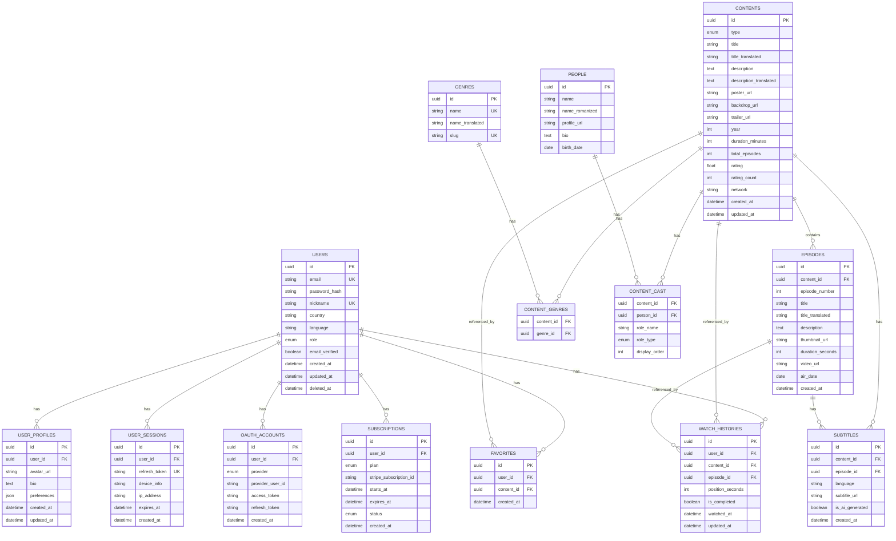

# DATA_MODEL.md - 데이터 모델

## 변경 이력 (Changelog)

| 버전 | 날짜 | 작성자 | 변경 내용 |
|------|------|--------|----------|
| 1.0.0 | 2025-11-25 | @hallyulatino-team | 최초 작성 |

## 관련 문서 (Related Documents)

- [ARCHITECTURE.md](./ARCHITECTURE.md) - 시스템 아키텍처
- [API_SPEC.md](./API_SPEC.md) - API 명세

---

## 1. ERD (Entity-Relationship Diagram)



---

## 2. 테이블 상세 (Table Definitions)

### 2.1 Users (사용자)

```sql
-- 사용자 테이블
CREATE TABLE users (
    id UUID PRIMARY KEY DEFAULT gen_random_uuid(),
    email VARCHAR(255) NOT NULL UNIQUE,
    password_hash VARCHAR(255),  -- OAuth 사용자는 NULL 가능
    nickname VARCHAR(50) NOT NULL UNIQUE,
    country CHAR(2) NOT NULL,  -- ISO 3166-1 alpha-2
    language CHAR(2) NOT NULL DEFAULT 'es',  -- es, pt
    role VARCHAR(20) NOT NULL DEFAULT 'user',  -- user, premium, creator, moderator, admin
    email_verified BOOLEAN NOT NULL DEFAULT FALSE,
    created_at TIMESTAMP WITH TIME ZONE NOT NULL DEFAULT CURRENT_TIMESTAMP,
    updated_at TIMESTAMP WITH TIME ZONE NOT NULL DEFAULT CURRENT_TIMESTAMP,
    deleted_at TIMESTAMP WITH TIME ZONE  -- Soft delete
);

-- 인덱스
CREATE INDEX idx_users_email ON users(email);
CREATE INDEX idx_users_nickname ON users(nickname);
CREATE INDEX idx_users_country ON users(country);
CREATE INDEX idx_users_created_at ON users(created_at);

-- 코멘트
COMMENT ON TABLE users IS '사용자 계정 정보';
COMMENT ON COLUMN users.role IS 'user: 일반, premium: 프리미엄, creator: 크리에이터, moderator: 관리자, admin: 어드민';
```

### 2.2 User Profiles (사용자 프로필)

```sql
-- 사용자 프로필 테이블
CREATE TABLE user_profiles (
    id UUID PRIMARY KEY DEFAULT gen_random_uuid(),
    user_id UUID NOT NULL REFERENCES users(id) ON DELETE CASCADE,
    avatar_url VARCHAR(500),
    bio TEXT,
    preferences JSONB NOT NULL DEFAULT '{}'::jsonb,
    created_at TIMESTAMP WITH TIME ZONE NOT NULL DEFAULT CURRENT_TIMESTAMP,
    updated_at TIMESTAMP WITH TIME ZONE NOT NULL DEFAULT CURRENT_TIMESTAMP,
    UNIQUE(user_id)
);

-- preferences 예시:
-- {
--   "subtitle_language": "es",
--   "video_quality": "auto",
--   "notifications": {"email": true, "push": true},
--   "privacy": {"show_watch_history": false}
-- }

COMMENT ON TABLE user_profiles IS '사용자 프로필 및 설정';
```

### 2.3 Contents (콘텐츠)

```sql
-- 콘텐츠 테이블
CREATE TABLE contents (
    id UUID PRIMARY KEY DEFAULT gen_random_uuid(),
    type VARCHAR(20) NOT NULL,  -- drama, movie, variety, kpop
    title VARCHAR(255) NOT NULL,  -- 원어 제목
    title_translated VARCHAR(255),  -- 번역된 제목
    original_title VARCHAR(255),  -- 원작 제목 (있는 경우)
    description TEXT,
    description_translated TEXT,
    poster_url VARCHAR(500),
    backdrop_url VARCHAR(500),
    trailer_url VARCHAR(500),
    year INTEGER NOT NULL,
    duration_minutes INTEGER,  -- 영화/에피소드 평균 길이
    total_episodes INTEGER DEFAULT 1,
    rating DECIMAL(2,1) DEFAULT 0,
    rating_count INTEGER DEFAULT 0,
    network VARCHAR(100),  -- 방송사
    is_exclusive BOOLEAN DEFAULT FALSE,
    status VARCHAR(20) DEFAULT 'active',  -- active, coming_soon, ended
    created_at TIMESTAMP WITH TIME ZONE NOT NULL DEFAULT CURRENT_TIMESTAMP,
    updated_at TIMESTAMP WITH TIME ZONE NOT NULL DEFAULT CURRENT_TIMESTAMP
);

-- 인덱스
CREATE INDEX idx_contents_type ON contents(type);
CREATE INDEX idx_contents_year ON contents(year);
CREATE INDEX idx_contents_rating ON contents(rating DESC);
CREATE INDEX idx_contents_created_at ON contents(created_at DESC);
CREATE INDEX idx_contents_title_gin ON contents USING gin(to_tsvector('simple', title));

COMMENT ON TABLE contents IS 'K-콘텐츠 (드라마, 영화, 예능, K-Pop)';
```

### 2.4 Episodes (에피소드)

```sql
-- 에피소드 테이블
CREATE TABLE episodes (
    id UUID PRIMARY KEY DEFAULT gen_random_uuid(),
    content_id UUID NOT NULL REFERENCES contents(id) ON DELETE CASCADE,
    episode_number INTEGER NOT NULL,
    title VARCHAR(255),
    title_translated VARCHAR(255),
    description TEXT,
    thumbnail_url VARCHAR(500),
    duration_seconds INTEGER NOT NULL,
    video_url VARCHAR(500) NOT NULL,  -- S3 경로 또는 CDN URL
    air_date DATE,
    created_at TIMESTAMP WITH TIME ZONE NOT NULL DEFAULT CURRENT_TIMESTAMP,
    UNIQUE(content_id, episode_number)
);

-- 인덱스
CREATE INDEX idx_episodes_content_id ON episodes(content_id);

COMMENT ON TABLE episodes IS '콘텐츠의 에피소드';
```

### 2.5 Genres (장르)

```sql
-- 장르 테이블
CREATE TABLE genres (
    id UUID PRIMARY KEY DEFAULT gen_random_uuid(),
    name VARCHAR(50) NOT NULL UNIQUE,  -- 한국어
    name_translated VARCHAR(50),  -- 번역 (스페인어)
    slug VARCHAR(50) NOT NULL UNIQUE
);

-- 콘텐츠-장르 연결
CREATE TABLE content_genres (
    content_id UUID NOT NULL REFERENCES contents(id) ON DELETE CASCADE,
    genre_id UUID NOT NULL REFERENCES genres(id) ON DELETE CASCADE,
    PRIMARY KEY (content_id, genre_id)
);

-- 기본 장르 데이터
INSERT INTO genres (name, name_translated, slug) VALUES
    ('로맨스', 'Romance', 'romance'),
    ('코미디', 'Comedia', 'comedy'),
    ('스릴러', 'Thriller', 'thriller'),
    ('액션', 'Acción', 'action'),
    ('드라마', 'Drama', 'drama'),
    ('판타지', 'Fantasía', 'fantasy'),
    ('공포', 'Terror', 'horror'),
    ('역사', 'Histórico', 'historical'),
    ('범죄', 'Crimen', 'crime'),
    ('가족', 'Familia', 'family');
```

### 2.6 People & Cast (인물 및 출연진)

```sql
-- 인물 테이블
CREATE TABLE people (
    id UUID PRIMARY KEY DEFAULT gen_random_uuid(),
    name VARCHAR(100) NOT NULL,  -- 한글 이름
    name_romanized VARCHAR(100),  -- 로마자 표기
    profile_url VARCHAR(500),
    bio TEXT,
    birth_date DATE,
    created_at TIMESTAMP WITH TIME ZONE NOT NULL DEFAULT CURRENT_TIMESTAMP
);

-- 출연진 연결 테이블
CREATE TABLE content_cast (
    content_id UUID NOT NULL REFERENCES contents(id) ON DELETE CASCADE,
    person_id UUID NOT NULL REFERENCES people(id) ON DELETE CASCADE,
    role_name VARCHAR(100),  -- 배역명
    role_type VARCHAR(20) NOT NULL,  -- actor, director, writer, producer
    display_order INTEGER DEFAULT 0,
    PRIMARY KEY (content_id, person_id, role_type)
);

CREATE INDEX idx_content_cast_person ON content_cast(person_id);
```

### 2.7 Subtitles (자막)

```sql
-- 자막 테이블
CREATE TABLE subtitles (
    id UUID PRIMARY KEY DEFAULT gen_random_uuid(),
    content_id UUID NOT NULL REFERENCES contents(id) ON DELETE CASCADE,
    episode_id UUID REFERENCES episodes(id) ON DELETE CASCADE,
    language CHAR(2) NOT NULL,  -- es, pt, en, ko
    subtitle_url VARCHAR(500) NOT NULL,  -- VTT/SRT 파일 URL
    is_ai_generated BOOLEAN DEFAULT FALSE,
    quality_score DECIMAL(3,2),  -- AI 품질 점수 (0-1)
    created_at TIMESTAMP WITH TIME ZONE NOT NULL DEFAULT CURRENT_TIMESTAMP,
    UNIQUE(content_id, episode_id, language)
);

CREATE INDEX idx_subtitles_content ON subtitles(content_id);
CREATE INDEX idx_subtitles_episode ON subtitles(episode_id);
```

### 2.8 Watch History (시청 기록)

```sql
-- 시청 기록 테이블
CREATE TABLE watch_histories (
    id UUID PRIMARY KEY DEFAULT gen_random_uuid(),
    user_id UUID NOT NULL REFERENCES users(id) ON DELETE CASCADE,
    content_id UUID NOT NULL REFERENCES contents(id) ON DELETE CASCADE,
    episode_id UUID REFERENCES episodes(id) ON DELETE CASCADE,
    position_seconds INTEGER NOT NULL DEFAULT 0,
    is_completed BOOLEAN DEFAULT FALSE,
    watched_at TIMESTAMP WITH TIME ZONE NOT NULL DEFAULT CURRENT_TIMESTAMP,
    updated_at TIMESTAMP WITH TIME ZONE NOT NULL DEFAULT CURRENT_TIMESTAMP,
    UNIQUE(user_id, content_id, episode_id)
);

CREATE INDEX idx_watch_histories_user ON watch_histories(user_id);
CREATE INDEX idx_watch_histories_watched_at ON watch_histories(watched_at DESC);

COMMENT ON TABLE watch_histories IS '사용자 시청 기록 및 재생 위치';
```

### 2.9 Favorites (즐겨찾기)

```sql
-- 즐겨찾기 테이블
CREATE TABLE favorites (
    id UUID PRIMARY KEY DEFAULT gen_random_uuid(),
    user_id UUID NOT NULL REFERENCES users(id) ON DELETE CASCADE,
    content_id UUID NOT NULL REFERENCES contents(id) ON DELETE CASCADE,
    created_at TIMESTAMP WITH TIME ZONE NOT NULL DEFAULT CURRENT_TIMESTAMP,
    UNIQUE(user_id, content_id)
);

CREATE INDEX idx_favorites_user ON favorites(user_id);
CREATE INDEX idx_favorites_created_at ON favorites(created_at DESC);
```

### 2.10 Subscriptions (구독)

```sql
-- 구독 테이블
CREATE TABLE subscriptions (
    id UUID PRIMARY KEY DEFAULT gen_random_uuid(),
    user_id UUID NOT NULL REFERENCES users(id) ON DELETE CASCADE,
    plan VARCHAR(20) NOT NULL,  -- free, basic, premium
    stripe_subscription_id VARCHAR(100),
    stripe_customer_id VARCHAR(100),
    starts_at TIMESTAMP WITH TIME ZONE NOT NULL DEFAULT CURRENT_TIMESTAMP,
    expires_at TIMESTAMP WITH TIME ZONE,
    status VARCHAR(20) NOT NULL DEFAULT 'active',  -- active, canceled, expired, past_due
    created_at TIMESTAMP WITH TIME ZONE NOT NULL DEFAULT CURRENT_TIMESTAMP,
    updated_at TIMESTAMP WITH TIME ZONE NOT NULL DEFAULT CURRENT_TIMESTAMP
);

CREATE INDEX idx_subscriptions_user ON subscriptions(user_id);
CREATE INDEX idx_subscriptions_status ON subscriptions(status);
```

---

## 3. SQLAlchemy ORM 모델

### 3.1 User Model

```python
# src/backend/models/user.py
from datetime import datetime
from typing import Optional
from uuid import UUID, uuid4

from sqlalchemy import Boolean, Column, DateTime, Enum, String, Text
from sqlalchemy.dialects.postgresql import UUID as PG_UUID
from sqlalchemy.orm import relationship

from .base import Base


class UserRole(str, Enum):
    """사용자 역할"""
    USER = "user"
    PREMIUM = "premium"
    CREATOR = "creator"
    MODERATOR = "moderator"
    ADMIN = "admin"


class User(Base):
    """사용자 모델"""

    __tablename__ = "users"

    id = Column(PG_UUID(as_uuid=True), primary_key=True, default=uuid4)
    email = Column(String(255), unique=True, nullable=False, index=True)
    password_hash = Column(String(255), nullable=True)  # OAuth 사용자는 NULL
    nickname = Column(String(50), unique=True, nullable=False, index=True)
    country = Column(String(2), nullable=False)
    language = Column(String(2), nullable=False, default="es")
    role = Column(String(20), nullable=False, default="user")
    email_verified = Column(Boolean, nullable=False, default=False)
    created_at = Column(DateTime(timezone=True), nullable=False, default=datetime.utcnow)
    updated_at = Column(DateTime(timezone=True), nullable=False, default=datetime.utcnow, onupdate=datetime.utcnow)
    deleted_at = Column(DateTime(timezone=True), nullable=True)

    # 관계 설정
    profile = relationship("UserProfile", back_populates="user", uselist=False, cascade="all, delete-orphan")
    sessions = relationship("UserSession", back_populates="user", cascade="all, delete-orphan")
    oauth_accounts = relationship("OAuthAccount", back_populates="user", cascade="all, delete-orphan")
    watch_histories = relationship("WatchHistory", back_populates="user", cascade="all, delete-orphan")
    favorites = relationship("Favorite", back_populates="user", cascade="all, delete-orphan")
    subscription = relationship("Subscription", back_populates="user", uselist=False)

    def verify_password(self, password: str) -> bool:
        """비밀번호를 검증합니다."""
        from ..infrastructure.security.password_hasher import verify_password
        if not self.password_hash:
            return False
        return verify_password(password, self.password_hash)

    @property
    def is_premium(self) -> bool:
        """프리미엄 사용자 여부를 확인합니다."""
        return self.role in (UserRole.PREMIUM, UserRole.CREATOR, UserRole.ADMIN)

    def __repr__(self) -> str:
        return f"<User(id={self.id}, email={self.email})>"
```

### 3.2 Content Model

```python
# src/backend/models/content.py
from datetime import datetime
from decimal import Decimal
from typing import List, Optional
from uuid import UUID, uuid4

from sqlalchemy import Boolean, Column, DateTime, Integer, Numeric, String, Text
from sqlalchemy.dialects.postgresql import UUID as PG_UUID
from sqlalchemy.orm import relationship

from .base import Base


class ContentType(str, Enum):
    """콘텐츠 타입"""
    DRAMA = "drama"
    MOVIE = "movie"
    VARIETY = "variety"
    KPOP = "kpop"


class Content(Base):
    """콘텐츠 모델"""

    __tablename__ = "contents"

    id = Column(PG_UUID(as_uuid=True), primary_key=True, default=uuid4)
    type = Column(String(20), nullable=False, index=True)
    title = Column(String(255), nullable=False)
    title_translated = Column(String(255))
    original_title = Column(String(255))
    description = Column(Text)
    description_translated = Column(Text)
    poster_url = Column(String(500))
    backdrop_url = Column(String(500))
    trailer_url = Column(String(500))
    year = Column(Integer, nullable=False, index=True)
    duration_minutes = Column(Integer)
    total_episodes = Column(Integer, default=1)
    rating = Column(Numeric(2, 1), default=0)
    rating_count = Column(Integer, default=0)
    network = Column(String(100))
    is_exclusive = Column(Boolean, default=False)
    status = Column(String(20), default="active")
    created_at = Column(DateTime(timezone=True), nullable=False, default=datetime.utcnow)
    updated_at = Column(DateTime(timezone=True), nullable=False, default=datetime.utcnow, onupdate=datetime.utcnow)

    # 관계 설정
    episodes = relationship("Episode", back_populates="content", cascade="all, delete-orphan", order_by="Episode.episode_number")
    genres = relationship("Genre", secondary="content_genres", back_populates="contents")
    cast = relationship("ContentCast", back_populates="content", cascade="all, delete-orphan")
    subtitles = relationship("Subtitle", back_populates="content", cascade="all, delete-orphan")

    def __repr__(self) -> str:
        return f"<Content(id={self.id}, title={self.title})>"
```

### 3.3 Watch History Model

```python
# src/backend/models/watch_history.py
from datetime import datetime
from uuid import UUID, uuid4

from sqlalchemy import Boolean, Column, DateTime, ForeignKey, Integer
from sqlalchemy.dialects.postgresql import UUID as PG_UUID
from sqlalchemy.orm import relationship

from .base import Base


class WatchHistory(Base):
    """시청 기록 모델"""

    __tablename__ = "watch_histories"

    id = Column(PG_UUID(as_uuid=True), primary_key=True, default=uuid4)
    user_id = Column(PG_UUID(as_uuid=True), ForeignKey("users.id", ondelete="CASCADE"), nullable=False, index=True)
    content_id = Column(PG_UUID(as_uuid=True), ForeignKey("contents.id", ondelete="CASCADE"), nullable=False)
    episode_id = Column(PG_UUID(as_uuid=True), ForeignKey("episodes.id", ondelete="CASCADE"))
    position_seconds = Column(Integer, nullable=False, default=0)
    is_completed = Column(Boolean, default=False)
    watched_at = Column(DateTime(timezone=True), nullable=False, default=datetime.utcnow, index=True)
    updated_at = Column(DateTime(timezone=True), nullable=False, default=datetime.utcnow, onupdate=datetime.utcnow)

    # 관계 설정
    user = relationship("User", back_populates="watch_histories")
    content = relationship("Content")
    episode = relationship("Episode")

    @property
    def progress_percent(self) -> int:
        """진행률을 계산합니다."""
        if self.episode and self.episode.duration_seconds > 0:
            return int((self.position_seconds / self.episode.duration_seconds) * 100)
        return 0

    def __repr__(self) -> str:
        return f"<WatchHistory(user_id={self.user_id}, content_id={self.content_id})>"
```

---

## 4. Elasticsearch 인덱스

### 4.1 콘텐츠 검색 인덱스

```json
{
  "settings": {
    "number_of_shards": 2,
    "number_of_replicas": 1,
    "analysis": {
      "analyzer": {
        "korean_analyzer": {
          "type": "custom",
          "tokenizer": "nori_tokenizer",
          "filter": ["lowercase", "nori_readingform"]
        },
        "spanish_analyzer": {
          "type": "custom",
          "tokenizer": "standard",
          "filter": ["lowercase", "spanish_stemmer"]
        }
      },
      "filter": {
        "spanish_stemmer": {
          "type": "stemmer",
          "language": "spanish"
        }
      }
    }
  },
  "mappings": {
    "properties": {
      "content_id": { "type": "keyword" },
      "type": { "type": "keyword" },
      "title": {
        "type": "text",
        "analyzer": "korean_analyzer",
        "fields": {
          "keyword": { "type": "keyword" }
        }
      },
      "title_translated": {
        "type": "text",
        "analyzer": "spanish_analyzer"
      },
      "description": {
        "type": "text",
        "analyzer": "korean_analyzer"
      },
      "description_translated": {
        "type": "text",
        "analyzer": "spanish_analyzer"
      },
      "genres": { "type": "keyword" },
      "cast": {
        "type": "nested",
        "properties": {
          "name": { "type": "text", "analyzer": "korean_analyzer" },
          "name_romanized": { "type": "text" }
        }
      },
      "year": { "type": "integer" },
      "rating": { "type": "float" },
      "rating_count": { "type": "integer" },
      "created_at": { "type": "date" },
      "suggest": {
        "type": "completion",
        "analyzer": "simple"
      }
    }
  }
}
```

---

## 5. 데이터 마이그레이션

### 5.1 Alembic 설정

```python
# alembic/env.py
from alembic import context
from sqlalchemy import engine_from_config, pool

from src.backend.models import Base
from src.backend.config import settings

target_metadata = Base.metadata

def run_migrations_online():
    """온라인 마이그레이션을 실행합니다."""
    connectable = engine_from_config(
        {"sqlalchemy.url": settings.DATABASE_URL},
        prefix="sqlalchemy.",
        poolclass=pool.NullPool,
    )

    with connectable.connect() as connection:
        context.configure(
            connection=connection,
            target_metadata=target_metadata,
            compare_type=True,
            compare_server_default=True,
        )

        with context.begin_transaction():
            context.run_migrations()
```

### 5.2 마이그레이션 명령어

```bash
# 마이그레이션 생성
alembic revision --autogenerate -m "Add users table"

# 마이그레이션 적용
alembic upgrade head

# 마이그레이션 롤백
alembic downgrade -1

# 히스토리 확인
alembic history
```

---

*이 데이터 모델 문서는 스키마 변경 시 업데이트됩니다.*
