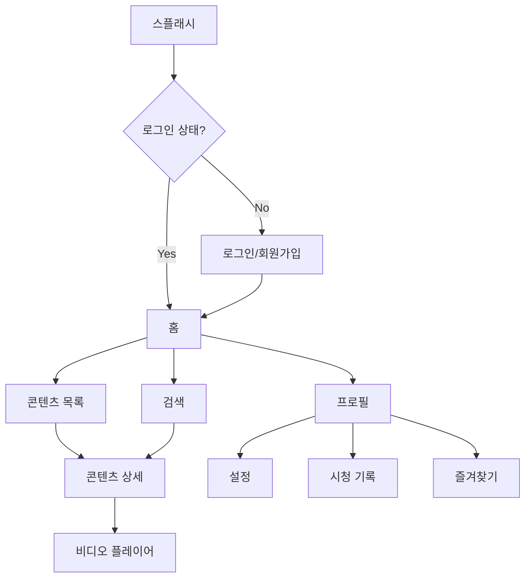

# PRD - 제품 요구사항 문서

## 변경 이력 (Changelog)

| 버전 | 날짜 | 작성자 | 변경 내용 |
|------|------|--------|----------|
| 1.0.0 | 2025-11-25 | @hallyulatino-team | 최초 작성 |

## 관련 문서 (Related Documents)

- [CONTEXT.md](../../CONTEXT.md) - 프로젝트 컨텍스트
- [ARCHITECTURE.md](./ARCHITECTURE.md) - 시스템 아키텍처
- [API_SPEC.md](./API_SPEC.md) - API 명세

---

## 1. 제품 개요 (Product Overview)

### 1.1 제품명
**HallyuLatino** (한류라티노)

### 1.2 제품 비전
라틴 아메리카 한류 팬들이 언어와 문화 장벽 없이 K-콘텐츠를 즐기고, 팬 커뮤니티에서 소통하며, AI 기반 개인화 경험을 누릴 수 있는 올인원 플랫폼

### 1.3 문제 정의 (Problem Statement)

```
┌─────────────────────────────────────────────────────────────┐
│                       현재 문제점                            │
├─────────────────────────────────────────────────────────────┤
│                                                             │
│  😞 언어 장벽     │ 한국어 콘텐츠의 스페인어/포르투갈어       │
│                  │ 자막/더빙 부족                           │
│                                                             │
│  🔍 접근성 부족   │ 합법적인 K-콘텐츠 스트리밍 플랫폼이       │
│                  │ 라틴 아메리카에 부족                      │
│                                                             │
│  👥 커뮤니티 분산 │ 팬 커뮤니티가 여러 플랫폼에 분산되어      │
│                  │ 교류가 어려움                            │
│                                                             │
│  🎯 개인화 부재   │ 라틴 사용자 취향에 맞는 추천 시스템 부재  │
│                                                             │
└─────────────────────────────────────────────────────────────┘
```

### 1.4 해결책 (Solution)

| 문제 | HallyuLatino 솔루션 |
|------|---------------------|
| 언어 장벽 | AI 기반 실시간 번역/자막/더빙 |
| 접근성 부족 | 라틴 아메리카 특화 스트리밍 플랫폼 |
| 커뮤니티 분산 | 통합 팬 커뮤니티 플랫폼 |
| 개인화 부재 | AI 추천 시스템 |

---

## 2. 목표 및 성공 지표 (Goals & Metrics)

### 2.1 비즈니스 목표

| 목표 | 지표 | 목표값 (1년) |
|------|------|--------------|
| 사용자 확보 | MAU (Monthly Active Users) | 100,000명 |
| 사용자 유지 | D30 Retention | 40% 이상 |
| 수익화 | 구독 전환율 | 5% |
| 콘텐츠 소비 | 월간 시청 시간 | 인당 10시간 |

### 2.2 North Star Metric

```
━━━━━━━━━━━━━━━━━━━━━━━━━━━━━━━━━━━━━━━━━━━━━━━━━━━━━━━━━━━━━
🌟 North Star Metric: 주간 활성 스트리밍 사용자 수 (WASU)
━━━━━━━━━━━━━━━━━━━━━━━━━━━━━━━━━━━━━━━━━━━━━━━━━━━━━━━━━━━━━

정의: 주당 최소 1회 이상 콘텐츠를 스트리밍한 고유 사용자 수

선정 이유:
• 핵심 가치 제안(스트리밍)과 직결
• 사용자 참여도와 가치 체감을 측정
• 수익 지표와 높은 상관관계
```

### 2.3 핵심 성과 지표 (KPIs)

| 카테고리 | 지표 | 측정 방법 | 목표 |
|----------|------|-----------|------|
| 획득 | 신규 가입자 수 | 일별 신규 등록 | 500명/일 |
| 활성화 | 가입 후 첫 스트리밍 | 가입 24시간 내 | 60% |
| 유지 | D7 Retention | 7일 후 재방문 | 50% |
| 매출 | ARPU | 월간 수익/MAU | $2 |
| 추천 | NPS | 분기별 설문 | 50 이상 |

---

## 3. 타겟 사용자 (Target Users)

### 3.1 주요 페르소나

#### 페르소나 1: Maria (K-Drama 팬)

```
┌─────────────────────────────────────────────────────────────┐
│  👩 Maria, 25세, 멕시코 시티                                 │
├─────────────────────────────────────────────────────────────┤
│  직업: 대학생 (경영학)                                       │
│  언어: 스페인어 (모국어), 영어 (중급)                         │
│  한류 경력: 3년                                              │
│                                                             │
│  📺 시청 습관:                                               │
│  • 매일 저녁 2-3시간 K-Drama 시청                            │
│  • 주로 Netflix, Viki 사용                                   │
│  • 스페인어 자막 필수                                        │
│                                                             │
│  😤 Pain Points:                                             │
│  • 최신 드라마 자막이 늦게 나옴                               │
│  • 자막 품질이 들쭉날쭉                                       │
│  • 같이 볼 친구들과 소통 공간 부족                            │
│                                                             │
│  ✨ Goals:                                                   │
│  • 최신 K-Drama를 스페인어 자막으로 빠르게 시청               │
│  • 다른 팬들과 감상 공유                                      │
│  • 배우/드라마 관련 소식 빠르게 접하기                         │
│                                                             │
└─────────────────────────────────────────────────────────────┘
```

#### 페르소나 2: Lucas (K-Pop 팬)

```
┌─────────────────────────────────────────────────────────────┐
│  👨 Lucas, 19세, 상파울루                                    │
├─────────────────────────────────────────────────────────────┤
│  직업: 고등학생                                              │
│  언어: 포르투갈어 (모국어), 영어 (초급)                       │
│  한류 경력: 2년 (BTS로 입문)                                 │
│                                                             │
│  🎵 소비 습관:                                               │
│  • K-Pop MV 매일 시청                                        │
│  • 아이돌 팬캠, 비하인드 콘텐츠                               │
│  • Twitter, TikTok에서 팬 활동                               │
│                                                             │
│  😤 Pain Points:                                             │
│  • 한국 예능/인터뷰 자막이 없음                               │
│  • 실시간 소식을 영어로 봐야 함                               │
│  • 굿즈 구매가 어렵고 배송비가 비쌈                           │
│                                                             │
│  ✨ Goals:                                                   │
│  • 아이돌 콘텐츠를 포르투갈어로 시청                          │
│  • 팬 커뮤니티에서 활발히 활동                                │
│  • 굿즈 쉽게 구매하기                                        │
│                                                             │
└─────────────────────────────────────────────────────────────┘
```

#### 페르소나 3: Sofia (K-Beauty 관심자)

```
┌─────────────────────────────────────────────────────────────┐
│  👩 Sofia, 32세, 부에노스아이레스                             │
├─────────────────────────────────────────────────────────────┤
│  직업: 마케팅 매니저                                         │
│  언어: 스페인어 (모국어), 영어 (상급)                         │
│  한류 경력: 5년                                              │
│                                                             │
│  💄 관심사:                                                  │
│  • K-Beauty 스킨케어 루틴                                    │
│  • K-Drama를 통한 한국 문화 이해                              │
│  • 한국 여행 계획                                            │
│                                                             │
│  😤 Pain Points:                                             │
│  • 정품 K-Beauty 제품 구하기 어려움                           │
│  • 성분/사용법 정보가 한국어뿐                                │
│  • 신뢰할 수 있는 리뷰 부족                                   │
│                                                             │
│  ✨ Goals:                                                   │
│  • K-Beauty 제품 정보를 스페인어로                            │
│  • 진품 제품 구매                                            │
│  • 한국 문화 깊이 이해하기                                    │
│                                                             │
└─────────────────────────────────────────────────────────────┘
```

### 3.2 타겟 시장

| 시장 | 인구 | 인터넷 사용자 | 예상 TAM |
|------|------|---------------|----------|
| 멕시코 | 1.3억 | 9,200만 | 500만 |
| 브라질 | 2.1억 | 1.5억 | 800만 |
| 아르헨티나 | 4,500만 | 3,900만 | 200만 |
| 콜롬비아 | 5,100만 | 3,500만 | 150만 |
| 칠레 | 1,900만 | 1,600만 | 100만 |
| **합계** | - | - | **1,750만** |

---

## 4. 기능 요구사항 (Functional Requirements)

### 4.1 MVP 기능 (Phase 1)

#### FR-001: 사용자 인증

| ID | 요구사항 | 우선순위 | 상태 |
|----|----------|----------|------|
| FR-001-01 | 이메일/비밀번호 회원가입 | P0 | 계획됨 |
| FR-001-02 | 이메일/비밀번호 로그인 | P0 | 계획됨 |
| FR-001-03 | Google OAuth 로그인 | P0 | 계획됨 |
| FR-001-04 | Facebook OAuth 로그인 | P0 | 계획됨 |
| FR-001-05 | 비밀번호 재설정 | P0 | 계획됨 |
| FR-001-06 | 이메일 인증 | P1 | 계획됨 |

**상세 요구사항 (FR-001-01):**

```
┌─────────────────────────────────────────────────────────────┐
│ FR-001-01: 이메일/비밀번호 회원가입                          │
├─────────────────────────────────────────────────────────────┤
│ 설명:                                                       │
│ 사용자가 이메일과 비밀번호로 계정을 생성할 수 있다.           │
│                                                             │
│ 입력:                                                       │
│ • 이메일 (필수, 유효한 형식, 최대 255자)                     │
│ • 비밀번호 (필수, 최소 8자, 대소문자+숫자+특수문자)           │
│ • 닉네임 (필수, 2-20자, 영문/숫자/한글)                      │
│ • 국가 (필수, 드롭다운)                                      │
│ • 언어 선호도 (필수, 스페인어/포르투갈어)                     │
│ • 이용약관 동의 (필수)                                       │
│ • 개인정보처리방침 동의 (필수)                                │
│ • 마케팅 수신 동의 (선택)                                    │
│                                                             │
│ 처리:                                                       │
│ 1. 이메일 중복 검사                                          │
│ 2. 비밀번호 강도 검증                                        │
│ 3. 비밀번호 해싱 (bcrypt)                                    │
│ 4. 사용자 레코드 생성                                        │
│ 5. 인증 이메일 발송                                          │
│                                                             │
│ 출력 (성공):                                                 │
│ • 201 Created                                                │
│ • user_id, email, nickname 반환                              │
│ • 인증 이메일 발송 안내                                       │
│                                                             │
│ 출력 (실패):                                                 │
│ • 400 Bad Request: 입력 검증 실패                            │
│ • 409 Conflict: 이메일 중복                                  │
│                                                             │
│ 테스트 케이스:                                               │
│ • TC-001: 유효한 정보로 회원가입 성공                         │
│ • TC-002: 잘못된 이메일 형식으로 실패                         │
│ • TC-003: 약한 비밀번호로 실패                                │
│ • TC-004: 중복 이메일로 실패                                  │
│ • TC-005: 필수 필드 누락으로 실패                             │
└─────────────────────────────────────────────────────────────┘
```

#### FR-002: 콘텐츠 스트리밍

| ID | 요구사항 | 우선순위 | 상태 |
|----|----------|----------|------|
| FR-002-01 | 콘텐츠 목록 조회 | P0 | 계획됨 |
| FR-002-02 | 콘텐츠 상세 정보 조회 | P0 | 계획됨 |
| FR-002-03 | 비디오 스트리밍 | P0 | 계획됨 |
| FR-002-04 | 자막 표시 | P0 | 계획됨 |
| FR-002-05 | 재생 위치 저장/복원 | P1 | 계획됨 |
| FR-002-06 | 화질 선택 | P1 | 계획됨 |

#### FR-003: AI 자막

| ID | 요구사항 | 우선순위 | 상태 |
|----|----------|----------|------|
| FR-003-01 | 한→스페인어 번역 자막 | P0 | 계획됨 |
| FR-003-02 | 한→포르투갈어 번역 자막 | P0 | 계획됨 |
| FR-003-03 | 자막 언어 선택 | P0 | 계획됨 |
| FR-003-04 | 자막 싱크 조절 | P2 | 계획됨 |

#### FR-004: 콘텐츠 검색

| ID | 요구사항 | 우선순위 | 상태 |
|----|----------|----------|------|
| FR-004-01 | 키워드 검색 | P0 | 계획됨 |
| FR-004-02 | 카테고리 필터 | P0 | 계획됨 |
| FR-004-03 | 장르 필터 | P0 | 계획됨 |
| FR-004-04 | 자동완성 | P1 | 계획됨 |

#### FR-005: 사용자 프로필

| ID | 요구사항 | 우선순위 | 상태 |
|----|----------|----------|------|
| FR-005-01 | 프로필 조회/수정 | P1 | 계획됨 |
| FR-005-02 | 시청 기록 | P1 | 계획됨 |
| FR-005-03 | 즐겨찾기 | P1 | 계획됨 |
| FR-005-04 | 설정 관리 | P1 | 계획됨 |

#### FR-006: 추천 시스템

| ID | 요구사항 | 우선순위 | 상태 |
|----|----------|----------|------|
| FR-006-01 | 개인화 추천 | P1 | 계획됨 |
| FR-006-02 | 인기 콘텐츠 | P1 | 계획됨 |
| FR-006-03 | 신규 콘텐츠 | P1 | 계획됨 |

### 4.2 Phase 2 기능

| 카테고리 | 기능 | 우선순위 |
|----------|------|----------|
| 커뮤니티 | 게시판 | P2 |
| 커뮤니티 | 댓글/좋아요 | P2 |
| AI | AI 챗봇 | P2 |
| 실시간 | 실시간 채팅 | P2 |
| 마켓 | 굿즈 마켓플레이스 | P2 |

### 4.3 Phase 3 기능

| 카테고리 | 기능 | 우선순위 |
|----------|------|----------|
| AI | AI 더빙 | P3 |
| 학습 | 한국어 학습 | P3 |
| 크리에이터 | 팬 콘텐츠 플랫폼 | P3 |
| 이벤트 | 라이브 이벤트 | P3 |

---

## 5. 비기능 요구사항 (Non-Functional Requirements)

### 5.1 성능 (Performance)

| NFR ID | 요구사항 | 목표값 |
|--------|----------|--------|
| NFR-PERF-01 | API 응답 시간 (P50) | < 100ms |
| NFR-PERF-02 | API 응답 시간 (P95) | < 200ms |
| NFR-PERF-03 | API 응답 시간 (P99) | < 500ms |
| NFR-PERF-04 | 페이지 로드 시간 (LCP) | < 2.5s |
| NFR-PERF-05 | First Input Delay (FID) | < 100ms |
| NFR-PERF-06 | Cumulative Layout Shift | < 0.1 |
| NFR-PERF-07 | 스트리밍 시작 시간 | < 3s |
| NFR-PERF-08 | 동시 접속자 지원 | 10,000명 |

### 5.2 가용성 (Availability)

| NFR ID | 요구사항 | 목표값 |
|--------|----------|--------|
| NFR-AVAIL-01 | 서비스 가용성 | 99.9% (월간) |
| NFR-AVAIL-02 | 계획된 다운타임 | < 4시간/월 |
| NFR-AVAIL-03 | RTO (복구 시간 목표) | < 1시간 |
| NFR-AVAIL-04 | RPO (복구 지점 목표) | < 15분 |

### 5.3 확장성 (Scalability)

| NFR ID | 요구사항 | 목표값 |
|--------|----------|--------|
| NFR-SCALE-01 | 수평 확장 | Auto Scaling 지원 |
| NFR-SCALE-02 | 동시 스트리밍 | 5,000 세션 |
| NFR-SCALE-03 | 데이터베이스 | 읽기 복제본 지원 |

### 5.4 보안 (Security)

| NFR ID | 요구사항 | 상세 |
|--------|----------|------|
| NFR-SEC-01 | 인증 | JWT 기반 인증 |
| NFR-SEC-02 | 암호화 (전송) | TLS 1.3 |
| NFR-SEC-03 | 암호화 (저장) | AES-256 |
| NFR-SEC-04 | 비밀번호 해싱 | bcrypt (cost=12) |
| NFR-SEC-05 | OWASP Top 10 | 모든 취약점 대응 |
| NFR-SEC-06 | Rate Limiting | API별 제한 적용 |

### 5.5 규정 준수 (Compliance)

| NFR ID | 요구사항 | 상세 |
|--------|----------|------|
| NFR-COMP-01 | GDPR | EU 개인정보보호 |
| NFR-COMP-02 | LGPD | 브라질 개인정보보호법 |
| NFR-COMP-03 | 저작권 | DMCA 대응 |

---

## 6. 사용자 스토리 (User Stories)

### 인증

```
US-001: 회원가입
AS A 신규 사용자
I WANT TO 이메일로 계정을 생성하고 싶다
SO THAT 서비스를 이용할 수 있다

Acceptance Criteria:
• 유효한 이메일과 비밀번호로 계정 생성 가능
• 가입 후 인증 이메일 수신
• 중복 이메일로 가입 불가
• 약한 비밀번호로 가입 불가
```

```
US-002: 소셜 로그인
AS A 사용자
I WANT TO Google 계정으로 로그인하고 싶다
SO THAT 빠르게 서비스를 이용할 수 있다

Acceptance Criteria:
• Google OAuth 버튼 클릭으로 로그인 가능
• 첫 로그인 시 계정 자동 생성
• 기존 이메일과 연동 가능
```

### 콘텐츠

```
US-003: 콘텐츠 시청
AS A 한류 팬
I WANT TO K-Drama를 스트리밍으로 시청하고 싶다
SO THAT 언제 어디서나 즐길 수 있다

Acceptance Criteria:
• 콘텐츠 목록에서 선택하여 재생 가능
• 재생/일시정지/탐색 가능
• 화질 선택 가능
• 자막 표시 가능
```

```
US-004: AI 자막
AS A 스페인어 사용자
I WANT TO 스페인어 자막으로 드라마를 보고 싶다
SO THAT 내용을 이해할 수 있다

Acceptance Criteria:
• 스페인어/포르투갈어 자막 선택 가능
• 자막이 음성과 동기화됨
• 자막 크기/위치 조절 가능
```

### 검색

```
US-005: 콘텐츠 검색
AS A 사용자
I WANT TO 원하는 콘텐츠를 검색하고 싶다
SO THAT 빠르게 찾을 수 있다

Acceptance Criteria:
• 제목, 배우, 장르로 검색 가능
• 검색 결과가 관련도순으로 정렬
• 자동완성 지원
```

---

## 7. 화면 설계 (UI Wireframes)

### 7.1 주요 화면 목록

| 화면 | 설명 | 우선순위 |
|------|------|----------|
| 로그인/회원가입 | 인증 화면 | P0 |
| 홈 | 메인 대시보드 | P0 |
| 콘텐츠 목록 | 브라우징 | P0 |
| 콘텐츠 상세 | 정보 및 재생 | P0 |
| 비디오 플레이어 | 스트리밍 | P0 |
| 검색 | 검색 및 필터 | P0 |
| 프로필 | 사용자 정보 | P1 |
| 설정 | 앱 설정 | P1 |

### 7.2 화면 흐름



---

## 8. 릴리스 계획 (Release Plan)

### 8.1 MVP (Phase 1)

```
┌─────────────────────────────────────────────────────────────┐
│ MVP Release                                                  │
├─────────────────────────────────────────────────────────────┤
│ 목표: 핵심 스트리밍 + AI 자막 서비스 런칭                     │
│                                                             │
│ 포함 기능:                                                   │
│ ✓ 사용자 인증 (이메일/소셜)                                  │
│ ✓ 콘텐츠 스트리밍                                            │
│ ✓ AI 자막 (한→스페인어/포르투갈어)                           │
│ ✓ 콘텐츠 검색                                                │
│ ✓ 기본 프로필                                                │
│ ✓ 기본 추천                                                  │
│                                                             │
│ 타겟 사용자: 멕시코, 브라질 한류 팬                           │
│ 성공 기준: MAU 10,000명, D7 Retention 40%                    │
└─────────────────────────────────────────────────────────────┘
```

### 8.2 Phase 2

```
커뮤니티 + 실시간 기능 추가
• 팬 커뮤니티 (게시판, 댓글)
• AI 챗봇
• 실시간 채팅
• 굿즈 마켓플레이스
```

### 8.3 Phase 3

```
고급 기능 + 수익화 강화
• AI 더빙
• 한국어 학습
• 크리에이터 플랫폼
• 라이브 이벤트
```

---

## 9. 리스크 및 제약사항 (Risks & Constraints)

### 9.1 기술적 리스크

| 리스크 | 영향 | 확률 | 완화 전략 |
|--------|------|------|-----------|
| AI 번역 품질 | 높음 | 중간 | 휴먼 QA 병행, 피드백 수집 |
| 스트리밍 비용 | 높음 | 높음 | CDN 최적화, 캐싱 |
| 저작권 문제 | 높음 | 중간 | 법적 검토, 라이선스 확보 |

### 9.2 비즈니스 리스크

| 리스크 | 영향 | 확률 | 완화 전략 |
|--------|------|------|-----------|
| 경쟁사 진입 | 높음 | 중간 | 차별화 기능 강화 |
| 콘텐츠 수급 | 높음 | 중간 | 다양한 CP 확보 |
| 환율 변동 | 중간 | 높음 | 현지 가격 정책 |

### 9.3 제약사항

- **예산**: 초기 개발 및 운영 비용 제한
- **인력**: 소규모 팀으로 시작
- **시간**: MVP 빠른 런칭 필요
- **규제**: 국가별 콘텐츠 규제 대응 필요

---

## 10. 부록 (Appendix)

### A. 용어 정의

| 용어 | 정의 |
|------|------|
| K-Drama | 한국 드라마 |
| K-Pop | 한국 대중음악 |
| K-Beauty | 한국 화장품/뷰티 |
| 한류 (Hallyu) | 한국 문화의 해외 인기 현상 |
| MAU | Monthly Active Users (월간 활성 사용자) |
| ARPU | Average Revenue Per User (사용자당 평균 매출) |

### B. 참고 자료

- [Semantic Versioning](https://semver.org/)
- [OWASP Top 10](https://owasp.org/www-project-top-ten/)
- [Web Vitals](https://web.dev/vitals/)

---

*이 PRD는 제품 개발의 기반 문서로서 지속적으로 업데이트됩니다.*
